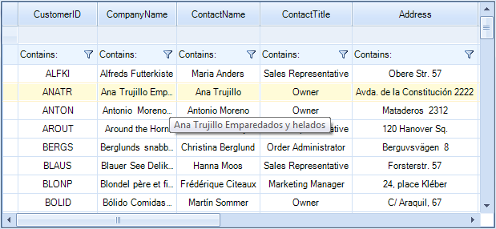
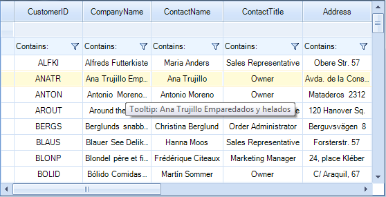

# ToolTips

There are two ways to assign tooltips to cells in __RadVirtualGrid__, namely setting the __ToolTipText__ property of a __VirtualGridCellElement__ in the __CellFormatting__ event handler, or as in most of the RadControls by using the __ToolTipTextNeeded__ event of __RadVirtualGrid__.


# Setting tooltips in the ToolTipTextNeeded event

The code snippet below demonstrates how you can use the __ToolTipTextNeeded__ event handler to set __ToolTipText__ for the given __VirtualGridCellElement__.


{{source=..\SamplesCS\VirtualGrid\Cells\VirtualGridFormattingCells.cs region=ToolTipTextNeeded}} 
{{source=..\SamplesVB\VirtualGrid\Cells\VirtualGridFormattingCells.vb region=ToolTipTextNeeded}}


````C#
        
private void radVirtualGrid1_ToolTipTextNeeded(object sender, ToolTipTextNeededEventArgs e)
{
    VirtualGridCellElement virtualCell = sender as VirtualGridCellElement;
    if (virtualCell != null)
    {
        e.ToolTipText = "Tooltip: " + virtualCell.Value + "";
    }
}

````
````VB.NET
Private Sub radVirtualGrid1_ToolTipTextNeeded(sender As Object, e As ToolTipTextNeededEventArgs)
    Dim virtualCell As VirtualGridCellElement = TryCast(sender, VirtualGridCellElement)
    If virtualCell IsNot Nothing Then
        e.ToolTipText = "Tooltip: " + virtualCell.Value + ""
    End If
End Sub

```` 

{{endregion}}

# Setting tooltips in the CellFormatting event handler  

The code snippet below demonstrates how you can assign a tooltip to a cell in __RadVirtualGrid__.



{{source=..\SamplesCS\VirtualGrid\Cells\VirtualGridFormattingCells.cs region=CellsTooltips}} 
{{source=..\SamplesVB\VirtualGrid\Cells\VirtualGridFormattingCells.vb region=CellsTooltips}}


````C#
        
private void radVirtualGrid1Tooltips_CellFormatting(object sender, VirtualGridCellElementEventArgs e)
{
    if (e.CellElement.RowIndex >= 0)
    {
        e.CellElement.ToolTipText = e.CellElement.Value + "";
    }
}

````
````VB.NET
Private Sub radVirtualGrid1Tooltips_CellFormatting(sender As Object, e As VirtualGridCellElementEventArgs)
    If e.CellElement.RowIndex >= 0 Then
        e.CellElement.ToolTipText = e.CellElement.Value + ""
    End If
End Sub

```` 

{{endregion}}

>note The __ToolTipTextNeeded__ event has higher priority and overrides the tooltips set in the __CellFormatting__ event handler.