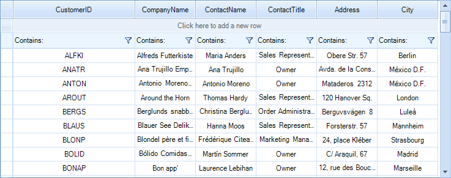
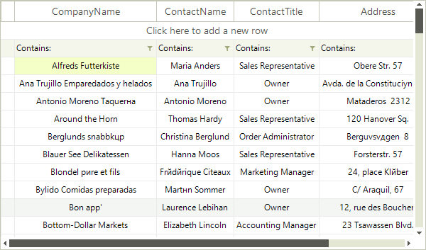
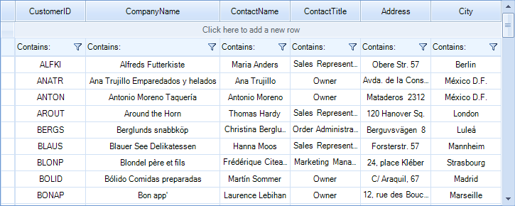
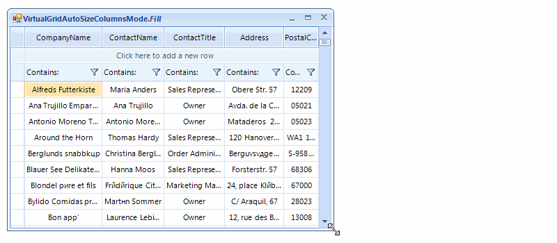

# Resizing Columns Programmatically

## Resizing Columns

The columns inside the __RadVirtualGrid__ are resizable by default. The user is able to easily change the column width by positioning the mouse over the columns vertical grid line and dragging it until the desired size is achieved.

## Disable Resizing

To restrict the resizing of all columns by the user set the __AllowColumnResize__ property of __RadVirtualGrid__ to *false*.

{{source=..\SamplesCS\VirtualGrid\Columns\VirtualGridColumnsResizingProgrammatically.cs region=AllowColumnResize}} 
{{source=..\SamplesVB\VirtualGrid\Columns\VirtualGridColumnsResizingProgrammatically.vb region=AllowColumnResize}}
````C#
this.radVirtualGrid1.AllowColumnResize = false;

````
````VB.NET
Me.RadVirtualGrid1.AllowColumnResize = False

```` 


{{endregion}}

## Programmatically Resizing Column

The width of columns can be set individually, per column. Note that the visible width will always include some amount of data even when set to very small amounts. To resize the columns programmatically you can use the following API:

>caption Fig.1 Resize a Colulm<br>


{{source=..\SamplesCS\VirtualGrid\Columns\VirtualGridColumnsResizingProgrammatically.cs region=ResizeSingleColumn}} 
{{source=..\SamplesVB\VirtualGrid\Columns\VirtualGridColumnsResizingProgrammatically.vb region=ResizeSingleColumn}}
````C#
this.radVirtualGrid1.TableElement.ColumnsViewState.SetItemSize(0, 200);

````
````VB.NET
Me.RadVirtualGrid1.TableElement.ColumnsViewState.SetItemSize(0, 200)

```` 


{{endregion}}

## Column Auto-Sizing

Columns can be auto-sized to a best fit value. The available API exposes methods for best-fitting all columns or just a single one:

>caption Fig.2 Best Fit All Columns<br>


{{source=..\SamplesCS\VirtualGrid\Columns\VirtualGridColumnsResizingProgrammatically.cs region=BestFitAllColumns}} 
{{source=..\SamplesVB\VirtualGrid\Columns\VirtualGridColumnsResizingProgrammatically.vb region=BestFitAllColumns}}
````C#
this.radVirtualGrid1.BestFitColumns();

````
````VB.NET
Me.RadVirtualGrid1.BestFitColumns()

````  

{{endregion}}

>caption Fig.3 Best Fit a Column<br>


{{source=..\SamplesCS\VirtualGrid\Columns\VirtualGridColumnsResizingProgrammatically.cs region=BestFitColumn}} 
{{source=..\SamplesVB\VirtualGrid\Columns\VirtualGridColumnsResizingProgrammatically.vb region=BestFitColumn}}
````C#
this.radVirtualGrid1.VirtualGridElement.BestFitColumn(1);

````
````VB.NET
Me.RadVirtualGrid1.VirtualGridElement.BestFitColumn(1)

````  
{{endregion}}

Columns can be auto-sized to fit the available space in __RadVirtualGrid__. It is necessary to set the __AutoSizeColumnsMode__ property to *VirtualGridAutoSizeColumnsMode.Fill*:

>caption Fig.4 AutoSizeColumnsMode.*Fill*


{{source=..\SamplesCS\VirtualGrid\Columns\VirtualGridColumnsResizingProgrammatically.cs region=AutoSizeColumnsMode}} 
{{source=..\SamplesVB\VirtualGrid\Columns\VirtualGridColumnsResizingProgrammatically.vb region=AutoSizeColumnsMode}}
````C#
this.radVirtualGrid1.AutoSizeColumnsMode = VirtualGridAutoSizeColumnsMode.Fill;
````
````VB.NET
Me.RadVirtualGrid1.AutoSizeColumnsMode = VirtualGridAutoSizeColumnsMode.Fill
````  
{{endregion}}

## Events

The API exposes two events for notifications when a change in the height of a row is about to happen or has already happened.

* __ColumnWidthChanging__: Raised before the operation starts, it can be canceled. The event arguments are:

 * __Cancel__: If set to *true* suspends the operation.

 * __NewWidth__: Value of the new column width.

 * __OldWidth__: Value of the old column width.

 * __ColumnIndex__: The index of the column which is about to be resized.
  
 * __ViewInfo__: Reference to the __VirtualGridViewInfo__ object.

* __ColumnWidthChanged__: Raised after the execution of the resizing operation. The event arguments are:

 * __RowIndex__: The index of the resized column.
  
 * __ViewInfo__: Reference to the __VirtualGridViewInfo__ object.

{{source=..\SamplesCS\VirtualGrid\Columns\VirtualGridColumnsResizingProgrammatically.cs region=ResizingEvents}} 
{{source=..\SamplesVB\VirtualGrid\Columns\VirtualGridColumnsResizingProgrammatically.vb region=ResizingEvents}}
````C#
private void radVirtualGrid1_ColumnWidthChanging(object sender, VirtualGridColumnWidthChangingEventArgs e)
{
    if (e.ColumnIndex == 0)
    {
        e.Cancel = true;
    }
}
private void radVirtualGrid1_ColumnWidthChanged(object sender, VirtualGridColumnEventArgs e)
{
}

````
````VB.NET
Private Sub radVirtualGrid1_ColumnWidthChanging(sender As Object, e As VirtualGridColumnWidthChangingEventArgs)
    If e.ColumnIndex = 0 Then
        e.Cancel = True
    End If
End Sub
Private Sub radVirtualGrid1_ColumnWidthChanged(sender As Object, e As VirtualGridColumnEventArgs)
End Sub

```` 


{{endregion}}