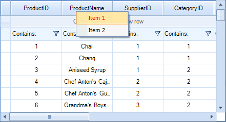
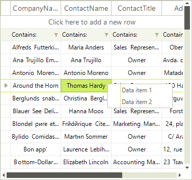
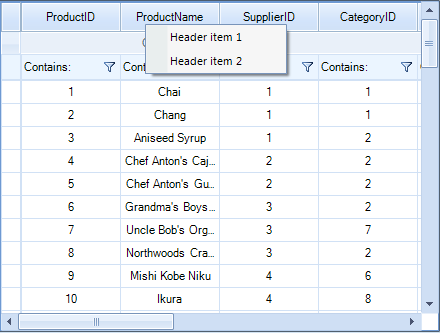

# Custom context Menu

__RadVirtualGrid__ provides a straightforward way to use custom context menus, instead of the default one. This context menu will appear every time the user right-clicks the __RadVirtualGrid__, regardless of the element of the control they click.


 
Start by creating a __RadContextMenu__, initializing its items, and subscribing for the events that you want to handle to achieve the desired behavior:

#### Create a RadContextMenu and initialize its items

{{source=..\SamplesCS\VirtualGrid\ContextMenu\VirtualGridContextMenu.cs region=InitializeContextMenu}} 
{{source=..\SamplesVB\VirtualGrid\ContextMenu\VirtualGridContextMenu.vb region=InitializeContextMenu}} 

````C#
        
RadContextMenu contextMenu = new RadContextMenu();
        
public VirtualGridContextMenu()
{
    InitializeComponent(); 
    
    RadMenuItem menuItem1 = new RadMenuItem("Item 1");
    menuItem1.ForeColor = Color.Red; 
    menuItem1.Click += menuItem1_Click;
    RadMenuItem menuItem2 = new RadMenuItem("Item 2"); 
    menuItem2.Click += menuItem2_Click;
    contextMenu.Items.Add(menuItem1);
    contextMenu.Items.Add(menuItem2);
    this.radVirtualGrid1.ContextMenuOpening += radVirtualGrid1_ContextMenuOpening;
}
        
private void menuItem1_Click(object sender, EventArgs e)
{
    RadMessageBox.Show("Item1");
}
        
private void menuItem2_Click(object sender, EventArgs e)
{
    RadMessageBox.Show("Item2");
}

````
````VB.NET
Private contextMenu As New RadContextMenu()
Public Sub New()
    InitializeComponent()
    Dim menuItem1 As New RadMenuItem("Item 1")
    menuItem1.ForeColor = Color.Red
    AddHandler menuItem1.Click, AddressOf menuItem1_Click
    Dim menuItem2 As New RadMenuItem("Item 2")
    AddHandler menuItem2.Click, AddressOf menuItem2_Click
    contextMenu.Items.Add(menuItem1)
    contextMenu.Items.Add(menuItem2)
    AddHandler Me.RadVirtualGrid1.ContextMenuOpening, AddressOf radVirtualGrid1_ContextMenuOpening
End Sub
Private Sub menuItem1_Click(sender As Object, e As EventArgs)
    RadMessageBox.Show("Item1")
End Sub
Private Sub menuItem2_Click(sender As Object, e As EventArgs)
    RadMessageBox.Show("Item2")
End Sub

````

{{endregion}} 

Once the menu object has been initialized and populated with menu items, it is ready to be attached to the __RadVirtualGrid__. To do that, subscribe to the __ContextMenuOpening__ event and set the context menu to be displayed:

#### Apply the custom context menu

{{source=..\SamplesCS\VirtualGrid\ContextMenu\VirtualGridContextMenu.cs region=ApplyCustomContextMenu}} 
{{source=..\SamplesVB\VirtualGrid\ContextMenu\VirtualGridContextMenu.vb region=ApplyCustomContextMenu}} 

````C#
        
private void radVirtualGrid1_ContextMenuOpening(object sender, VirtualGridContextMenuOpeningEventArgs e)
{
    e.ContextMenu = contextMenu.DropDown;
}

````
````VB.NET
Private Sub radVirtualGrid1_ContextMenuOpening(sender As Object, e As VirtualGridContextMenuOpeningEventArgs)
    e.ContextMenu = contextMenu.DropDown
End Sub

````

{{endregion}}

# Conditional Custom Context Menus

Applications may need to provide specific individual context menus depending on the element that was clicked. The following example demonstrates how to create two __RadContextMenu__ instances, filled with two items each. Then, according to the right-clicked cell element, apply the relevant menu.

#### Create custom context menus

{{source=..\SamplesCS\VirtualGrid\ContextMenu\VirtualGridContextMenu.cs region=ConditionalMenus}} 
{{source=..\SamplesVB\VirtualGrid\ContextMenu\VirtualGridContextMenu.vb region=ConditionalMenus}} 

````C#
        
RadContextMenu contextMenu1 = new RadContextMenu();
RadContextMenu contextMenu2 = new RadContextMenu();
        
public void BuildCustomContextMenus()
{
    RadMenuItem item1 = new RadMenuItem("Data item 1"); 
    item1.Click += item1_Click;
    RadMenuItem item2 = new RadMenuItem("Data item 2");
    item2.Click += item2_Click;
    contextMenu1.Items.Add(item1);
    contextMenu1.Items.Add(item2);
    
    RadMenuItem item3 = new RadMenuItem("Header item 1");
    item3.Click += item3_Click;
    RadMenuItem item4 = new RadMenuItem("Header item 2");
    item4.Click += item4_Click;
    contextMenu2.Items.Add(item3);
    contextMenu2.Items.Add(item4);
}
        
private void item4_Click(object sender, EventArgs e)
{
    RadMessageBox.Show("Header item 2");
}
        
private void item3_Click(object sender, EventArgs e)
{
    RadMessageBox.Show("Header item 1");
}
        
private void item2_Click(object sender, EventArgs e)
{
    RadMessageBox.Show("Data item 2");
}
        
private void item1_Click(object sender, EventArgs e)
{
    RadMessageBox.Show("Data item 1");
}

````
````VB.NET
Private contextMenu1 As New RadContextMenu()
Private contextMenu2 As New RadContextMenu()
Public Sub BuildCustomContextMenus()
    Dim item1 As New RadMenuItem("Data item 1")
    AddHandler item1.Click, AddressOf item1_Click
    Dim item2 As New RadMenuItem("Data item 2")
    AddHandler item2.Click, AddressOf item2_Click
    contextMenu1.Items.Add(item1)
    contextMenu1.Items.Add(item2)
    Dim item3 As New RadMenuItem("Header item 1")
    AddHandler item3.Click, AddressOf item3_Click
    Dim item4 As New RadMenuItem("Header item 2")
    AddHandler item4.Click, AddressOf item4_Click
    contextMenu2.Items.Add(item3)
    contextMenu2.Items.Add(item4)
End Sub
Private Sub item4_Click(sender As Object, e As EventArgs)
    RadMessageBox.Show("Header item 2")
End Sub
Private Sub item3_Click(sender As Object, e As EventArgs)
    RadMessageBox.Show("Header item 1")
End Sub
Private Sub item2_Click(sender As Object, e As EventArgs)
    RadMessageBox.Show("Data item 2")
End Sub
Private Sub item1_Click(sender As Object, e As EventArgs)
    RadMessageBox.Show("Data item 1")
End Sub

````

{{endregion}}

#### Apply the relevant menu

{{source=..\SamplesCS\VirtualGrid\ContextMenu\VirtualGridContextMenu.cs region=SetConditionalMenus}} 
{{source=..\SamplesVB\VirtualGrid\ContextMenu\VirtualGridContextMenu.vb region=SetConditionalMenus}} 

````C#
        
private void ConditionalCustom_ContextMenuOpening(object sender, VirtualGridContextMenuOpeningEventArgs e)
{
    if (e.RowIndex == -1)
    {
        e.ContextMenu = contextMenu2.DropDown;
    }
    else if (e.RowIndex >= 0)
    {
        e.ContextMenu = contextMenu1.DropDown;
    }
}

````
````VB.NET
Private Sub ConditionalCustom_ContextMenuOpening(sender As Object, e As VirtualGridContextMenuOpeningEventArgs)
    If e.RowIndex = -1 Then
        e.ContextMenu = contextMenu2.DropDown
    ElseIf e.RowIndex >= 0 Then
        e.ContextMenu = contextMenu1.DropDown
    End If
End Sub

````

{{endregion}}

|Data Cells Menu|Header Cells Menu|
|----|----|
|||

# See Also
* [Overview]()

* [Modifying the Default Context Menu]()

