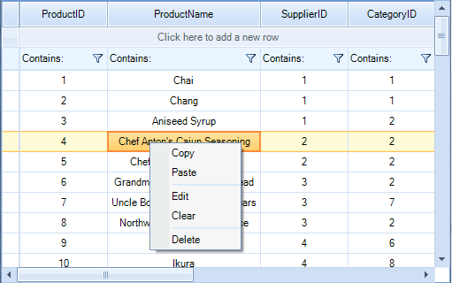
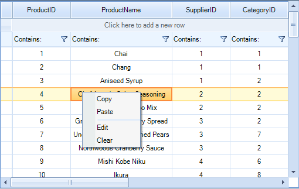
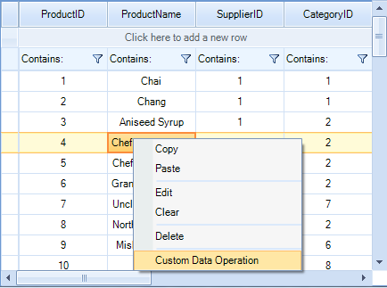

The default __RadVirtualGrid__ context menu can be customized in the __ContextMenuOpening__ event.

# Removing an item from the default RadVirtualGrid context menu:

{{source=..\SamplesCS\VirtualGrid\ContextMenu\VirtualGridContextMenu.cs region=RemoveItem}} 
{{source=..\SamplesVB\VirtualGrid\ContextMenu\VirtualGridContextMenu.vb region=RemoveItem}} 

````C#
        
private void Remove_ContextMenuOpening(object sender, VirtualGridContextMenuOpeningEventArgs e)
{
    for (int i = 0; i < e.ContextMenu.Items.Count; i++)
    {
        if (e.ContextMenu.Items[i].Text == "Delete")
        {
            // hide the Delete option from the context menu
            e.ContextMenu.Items[i].Visibility = Telerik.WinControls.ElementVisibility.Collapsed;
            // hide the separator before the Delete option
            e.ContextMenu.Items[i - 1].Visibility = Telerik.WinControls.ElementVisibility.Collapsed;
        }
    }
}

````
````VB.NET
Private Sub Remove_ContextMenuOpening(sender As Object, e As VirtualGridContextMenuOpeningEventArgs)
    For i As Integer = 0 To e.ContextMenu.Items.Count - 1
        If e.ContextMenu.Items(i).Text = "Delete" Then
            ' hide the Delete option from the context menu
            e.ContextMenu.Items(i).Visibility = Telerik.WinControls.ElementVisibility.Collapsed
            ' hide the separator before the Delete option
            e.ContextMenu.Items(i - 1).Visibility = Telerik.WinControls.ElementVisibility.Collapsed
        End If
    Next
End Sub

````

{{endregion}} 

|Default Context Menu|Modified Context Menu|
|----|----|
|||

# Adding menu items to the default RadVirtualGrid context menu
 
In order to add custom menu items to the default context menu, you should create menu item instances in the __ContextMenuOpening__ event handler and add them to the __VirtualGridContextMenuOpeningEventArgs.ContextMenu.Items__ collection:

#### Adding items to the default RadVirtualGrid context menu:

{{source=..\SamplesCS\VirtualGrid\ContextMenu\VirtualGridContextMenu.cs region=AddItem}} 
{{source=..\SamplesVB\VirtualGrid\ContextMenu\VirtualGridContextMenu.vb region=AddItem}} 

````C#
        
private void Add_ContextMenuOpening(object sender, VirtualGridContextMenuOpeningEventArgs e)
{
    RadMenuItem customMenuItem = new RadMenuItem();
    customMenuItem.Text = "Custom Data Operation";
    RadMenuSeparatorItem separator = new RadMenuSeparatorItem();
    e.ContextMenu.Items.Add(separator);
    e.ContextMenu.Items.Add(customMenuItem);
}

````
````VB.NET
Private Sub Add_ContextMenuOpening(sender As Object, e As VirtualGridContextMenuOpeningEventArgs)
    Dim customMenuItem As New RadMenuItem()
    customMenuItem.Text = "Custom Data Operation"
    Dim separator As New RadMenuSeparatorItem()
    e.ContextMenu.Items.Add(separator)
    e.ContextMenu.Items.Add(customMenuItem)
End Sub

````

{{endregion}} 

|Default Context Menu|Modified Context Menu|
|----|----|
|||
