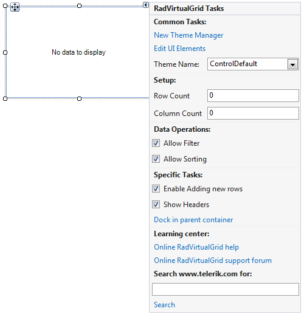

# Smart Tag

The Smart Tag for __RadVirtualGrid__ lets you quickly access common tasks involved with building the grid and customizing appearance through themes.

* __Common Tasks__

	* __New Theme Manager__: Adds a new __RadThemeManager__ component to the form.

	* __Edit UI elements__: Opens a dialog that displays the *Element Hierarchy Editor*. This editor lets you browse all the elements in the control.

	* __Theme Name__: Select a theme name from the drop down list of themes available for that control. Selecting a theme allows you to change all aspects of the controls visual style at one time.

* __Setup__
	* __RowCount__: Specifies how many rows the grid needs to display.
	
	* __ColumnCount__: Specifies how many columns the grid needs to display.

* __Data Operations__
	* __Allow Filter__: Controls whether the filtering operation is enabled.

	* __Allow Sorting__: Controls whether the sorting operation is enabled.

* __Specific Tasks__

	* __Enable Adding new rows__: Controls whether the new row is visible to the end-user.

	* __Show Headers__: Determines whether the header row is visible to the end-user. 

* __Learning Center__: Navigate to the Telerik help, code library projects or support forum.

* __Search__: Search the Telerik site for a given string.

# See Also

* [Element Hierarchy Editor]()

 
