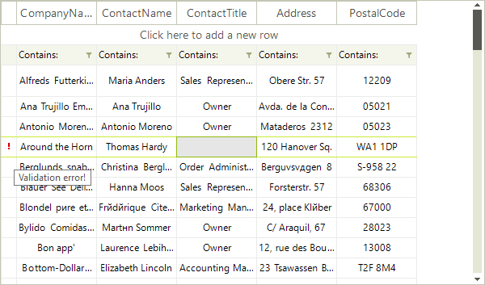

## Data Validation

__RadVirtualGrid__ provides a convenient way to perform validation before data is committed to the associated data source. You can validate data by handling __CellValidating__ event which is raised by __RadVirtualGrid__ when the current cell changes or when the cell loses input focus (when pressing Enter key). Canceling this event prevents the user from exiting the cell until a valid editor value is entered or the edit process is canceled. The __RowValidating__ event can be used the same way to prevent the user from exiting the current row.

Here is a list of all validation events: 

* __CellValidating:__ Fires when a cell loses input focus, enabling content validation. 

* __RowValidating:__ Fires when a row is validating.

* __RowValidated:__ Fires after a row has finished validating.

The VirtualGridViewInfo.__SetRowErrorText__ method can be used to indicate validation errors. It will show an error indicator at the row header.

The code snippet below demonstrates simple data validation scenario. It is enabled in the third column to enter only non-empty strings. When the string is empty, the validation fails and the error indicator at the row header is shown:

>caption Figure 1: Cell validation




{{source=..\SamplesCS\VirtualGrid\Editing\EditorsProperties.cs region=CellValidating}} 
{{source=..\SamplesVB\VirtualGrid\Editing\EditorsProperties.vb region=CellValidating}}
````C#
        
private void radVirtualGrid1_CellValidating(object sender, VirtualGridCellValidatingEventArgs e)
{
    if (e.RowIndex >= 0 && e.ColumnIndex == 2)
    {
        e.ViewInfo.SetRowErrorText(e.RowIndex, "Validation error!");
        if (string.IsNullOrEmpty((string)e.NewValue) || ((string)e.NewValue).Trim() == string.Empty)
        {
            e.Cancel = true;
            e.ViewInfo.SetRowErrorText(e.RowIndex, "Validation error!");
        }
        else
        {
            e.ViewInfo.ClearRowErrorText(e.RowIndex);
        }
    }
}

````
````VB.NET
Private Sub radVirtualGrid1_CellValidating(sender As Object, e As VirtualGridCellValidatingEventArgs)
    If e.RowIndex >= 0 AndAlso e.ColumnIndex = 2 Then
        e.ViewInfo.SetRowErrorText(e.RowIndex, "Validation error!")
        If String.IsNullOrEmpty(DirectCast(e.NewValue, String)) OrElse DirectCast(e.NewValue, String).Trim() = String.Empty Then
            e.Cancel = True
            e.ViewInfo.SetRowErrorText(e.RowIndex, "Validation error!")
        Else
            e.ViewInfo.ClearRowErrorText(e.RowIndex)
        End If
    End If
End Sub

````

{{endregion}}
