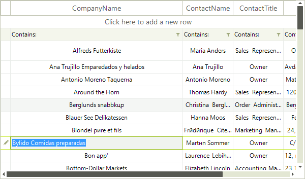
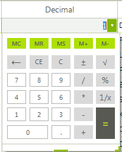
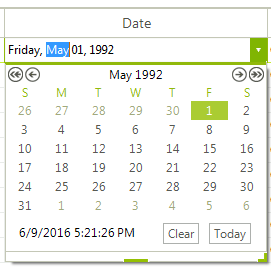
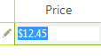
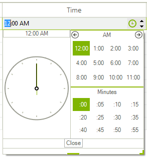
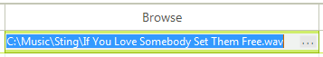

## Editors

__RadVirtualGrid__ allows the users to edit the cells values. Usually this process starts by typing in the cell or by pressing F2. By default the editor type is determined according to the data value type. When in edit mode, the user can change the cell value and press __Enter__ to commit the change or __Esc__ to revert to the original value. Clicking outside the edited cell also commits the change. 

>caption Row editing indication 

>

>note RadVirtualGrid can be made read-only by setting the __AllowEdit__ property to *false*. In this case the editors would not appear.
>

Currently, __RadVirtualGrid__ supports the following editors out of the box:

|Editor type|Description|Image|
|----|----|----|
|__VirtualGridCalculatorEditor__|Represents a calculator editor||
|__VirtualGridDateTimeEditor__|Represents a date time editor||
|__VirtualGridDropDownListEditor__|Represents a DropDownList editor||
|__VirtualGridMaskedEditBoxEditor__|Represents a masked editbox editor||
|__VirtualGridSpinEditor__|Represents a spin editor||
|__VirtualGridTextBoxControlEditor__|Represents a textbox control editor||
|__VirtualGridTextBoxEditor__|Represents a textbox editor||
|__VirtualGridTimePickerEditor__|Represents a time picker editor||
|__VirtualGridBrowseEditor__|Represents a browse editor||
|__VirtualGridColorPickerEditor__|Represents a color editor||


__RadVirtualGrid__ exposes an API for defining the data types of its columns. If the data type is explicitly set it wil determine the cell editors used in this column. Otherwise, the editor is determined by the cell value. The API works by column index.

#### Defining a Columns`s Data Type

{{source=..\SamplesCS\VirtualGrid\Editing\EditorsProperties.cs region=DefineColumnDataType}} 
{{source=..\SamplesVB\Virtualgrid\Editing\EditorsProperties.vb region=DefineColumnDataType}}
````C#
this.radVirtualGrid1.MasterViewInfo.ColumnDataTypes[0] = typeof(int);

````
````VB.NET
Me.radVirtualGrid1.MasterViewInfo.ColumnDataTypes(0) = GetType(Integer)

```` 

{{endregion}}

#### Reading a Columns`s Data Type

{{source=..\SamplesCS\VirtualGrid\Editing\EditorsProperties.cs region=ReadColumnDataType}} 
{{source=..\SamplesVB\Virtualgrid\Editing\EditorsProperties.vb region=ReadColumnDataType}}
````C#
Type dataType = this.radVirtualGrid1.MasterViewInfo.GetColumnDataType(1);

````
````VB.NET
Dim dataType As Type = Me.radVirtualGrid1.MasterViewInfo.GetColumnDataType(1)

```` 

{{endregion}}
