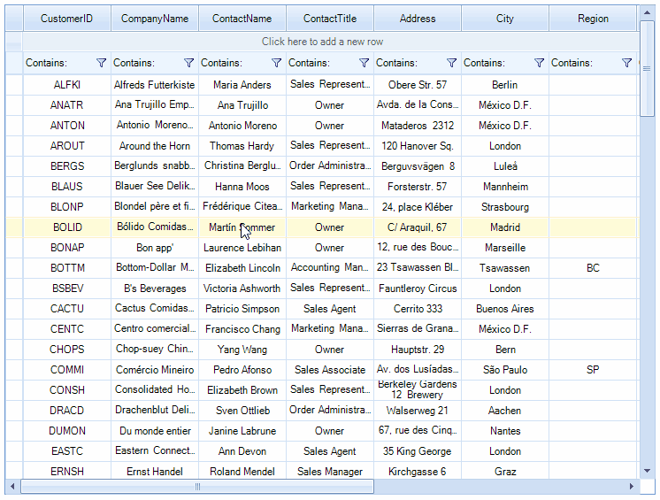

# Scrolling Support

__RadVirtualGrid__ supports scrolling out of the box. Once there is not enough space for the rows or columns scrollbars will appear and the user will be able to scroll. In addition the user can use the mouse wheel to scroll vertically and __Shift + Mouse Wheel__ to scroll horizontally.

See [this]() topic for detailed information on the available scroll modes.