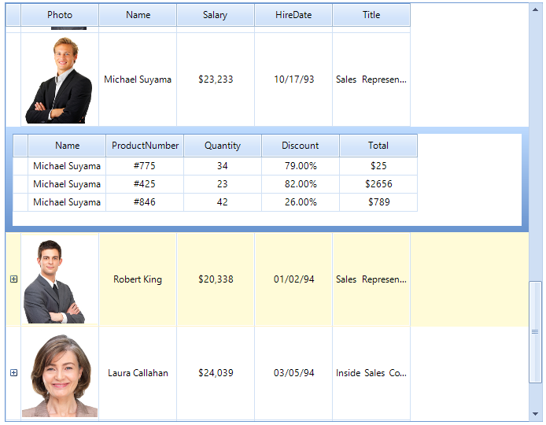

# Key Features

The purpose of __RadVirtualGrid__ is to provide server side data viewing and editing. The control provides UI for displaying and editing data and does not require all data to be available locally. Only the currently visible part of the data is requested from the grid and retrieved locally. In addition all operations performed by the end user (sorting, filtering) should be executed on the underlying data source. This allows working with very large amounts of data while providing the end users with outstanding performance.

Here are some of the currently supported key features:
* Customizable appearance
* Busy indicators
* Various data editors 
* Hierarchy
* Multiple selection
* Sorting
* Filtering
* Paging
* Editing

