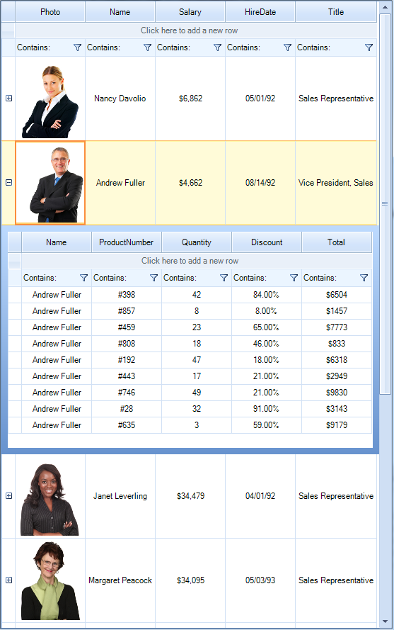

# Hierarchical Data

__RadVirtualGrid__ can display hierarchical, master-detail data to an arbitrary number of levels.
 


>caution Before proceeding with this article, please refer to the [Populating with Data]() help article which demonstrates how to fill data in __RadVirtualGrid__.

In order to fill the grid with hierarchical data, you should follow the steps below:

1\. Handle the __CellValueNeeded__ event. You should specify the __Value__ argument in the __VirtualGridCellValueNeededEventArgs__. 

2\. You will also need to set the __RowCount__ and __ColumnCount__ properties so that the grid will know how many rows/columns it needs to display.

3\. Handle the __QueryHasChildRows__ event which is fired for each row displayed in the associated __VirtualGridViewInfo__. Set the VirtualGridQueryHasChildRowsEventArgs.__HasChildRows__ property to *true* to indicate that the row has child rows.

4\. Subscribe to the __RowExpanding__ event in order to specify the __ColumnCount__ and __RowCount__ properties of the __ChildViewInfo__.

The following example demonstrates how to setup the hierarchy in __RadVirtualGrid__ by using the Northwind.Employees table:

#### Setup hierarchy

{{source=..\SamplesCS\VirtualGrid\Hierarchy\VirtualGridHierarchy.cs region=SetupHierarchy}} 
{{source=..\SamplesVB\VirtualGrid\Hierarchy\VirtualGridHierarchy.vb region=SetupHierarchy}}

````C#
        
List<Employee> data = new List<Employee>();
private void VirtualGridHierarchy_Load(object sender, EventArgs e)
{
    this.employeesTableAdapter.Fill(this.nwindDataSet.Employees);
    this.radVirtualGrid1.CellValueNeeded += radVirtualGrid1_CellValueNeeded;
    this.radVirtualGrid1.QueryHasChildRows += radVirtualGrid1_QueryHasChildRows;
    this.radVirtualGrid1.RowExpanding += radVirtualGrid1_RowExpanding;
    this.radVirtualGrid1.CellFormatting += radVirtualGrid1_CellFormatting;
    LoadData();
    this.radVirtualGrid1.TableElement.RowHeight = 120;
}
        
private void radVirtualGrid1_RowExpanding(object sender, VirtualGridRowExpandingEventArgs e)
{
    e.ChildViewInfo.ColumnCount = Sale.FieldNames.Length;
    e.ChildViewInfo.RowCount = data[e.ChildViewInfo.ParentRowIndex].Sales.Count;
}
        
private void radVirtualGrid1_CellFormatting(object sender, VirtualGridCellElementEventArgs e)
{
    //display the Employee's image
    if (e.CellElement.ColumnIndex < 0)
    {
        return;
    }
    
    if (e.CellElement.Value is Image)
    {
        e.CellElement.Image = (Image)e.CellElement.Value;
        e.CellElement.ImageLayout = ImageLayout.Zoom;
        e.CellElement.Text = "";
    }
    else
    {
        e.CellElement.ResetValue(LightVisualElement.ImageProperty, Telerik.WinControls.ValueResetFlags.Local);
    }
}
        
private void radVirtualGrid1_QueryHasChildRows(object sender, VirtualGridQueryHasChildRowsEventArgs e)
{
    e.HasChildRows = (e.ViewInfo == this.radVirtualGrid1.MasterViewInfo);
}
        
private void radVirtualGrid1_CellValueNeeded(object sender, VirtualGridCellValueNeededEventArgs e)
{
    if (e.ViewInfo == this.radVirtualGrid1.MasterViewInfo)
    {
        if (e.ColumnIndex < 0)
        {
            return;
        }
        
        e.FieldName = Employee.FieldNames[e.ColumnIndex];
        
        if (e.RowIndex == RadVirtualGrid.HeaderRowIndex)
        {
            e.Value = e.FieldName;
        }
        else if (e.RowIndex >= 0)
        {
            e.Value = data[e.RowIndex][e.ColumnIndex];
            if (e.ColumnIndex == 2)
            {
                e.FormatString = "${0:#,###}";
            }
            else if (e.ColumnIndex == 3)
            {
                e.FormatString = "{0:MM/dd/yy}";
            }
        }
    }
    else
    {
        if (e.ColumnIndex < 0)
        {
            return;
        }
        
        e.FieldName = Sale.FieldNames[e.ColumnIndex];
        
        if (e.RowIndex == RadVirtualGrid.HeaderRowIndex)
        {
            e.Value = e.FieldName;
        }
        else if (e.RowIndex >= 0)
        {
            e.Value = data[e.ViewInfo.ParentRowIndex].Sales[e.RowIndex][e.ColumnIndex];
            if (e.ColumnIndex == 1)
            {
                e.FormatString = "#{0}";
            }
            else if (e.ColumnIndex == 3)
            {
                e.FormatString = "{0:F2}%";
            }
            else if (e.ColumnIndex == 4)
            {
                e.FormatString = "${0}";
            }
        }
    }
}
        
private void LoadData()
{
    Random random = new Random();
    for (int i = 0; i < this.nwindDataSet.Employees.Count; i++)
    {
        DataSources.NwindDataSet.EmployeesRow row = this.nwindDataSet.Employees[i];
        Employee employee = new Employee();
        employee.Name = row.FirstName + " " + row.LastName;
        employee.Photo = GetImageFromBytes(row.Photo);
        employee.Salary = random.Next(45000);
        employee.HireDate = row.HireDate;
        employee.Title = row.Title;
        int rowCount = random.Next(20) + 1;
        for (int j = 0; j < rowCount; j++)
        {
            employee.Sales.Add(new Sale()
            {
                Name = employee.Name, ProductNumber = random.Next(1000),
                Quantity = random.Next(50), Discount = random.Next(100), Total = random.Next(10000)
            });
        }
        data.Add(employee);
    }
    this.radVirtualGrid1.RowCount = data.Count;
    this.radVirtualGrid1.ColumnCount = Employee.FieldNames.Length;
}
        
private Image GetImageFromBytes(byte[] bytes)
{
    Image result = null;
    MemoryStream stream = null;
    
    try
    {
        stream = new MemoryStream(bytes, 78, bytes.Length - 78);
        result = Image.FromStream(stream);
    }
    catch
    {
        try
        {
            stream = new MemoryStream(bytes, 0, bytes.Length);
            result = Image.FromStream(stream);
        }
        catch
        {
            result = null;
        }
    }
    finally
    {
        if (stream != null)
            stream.Close();
    }
    
    return result;
}

````
````VB.NET
Private data As New List(Of Employee)()
Private Sub VirtualGridHierarchy_Load(sender As Object, e As EventArgs) Handles MyBase.Load
    Me.EmployeesTableAdapter.Fill(Me.NwindDataSet.Employees)
    AddHandler Me.RadVirtualGrid1.CellValueNeeded, AddressOf radVirtualGrid1_CellValueNeeded
    AddHandler Me.RadVirtualGrid1.QueryHasChildRows, AddressOf radVirtualGrid1_QueryHasChildRows
    AddHandler Me.RadVirtualGrid1.RowExpanding, AddressOf radVirtualGrid1_RowExpanding
    AddHandler Me.RadVirtualGrid1.CellFormatting, AddressOf radVirtualGrid1_CellFormatting
    LoadData()
    Me.RadVirtualGrid1.TableElement.RowHeight = 120
End Sub
Private Sub radVirtualGrid1_RowExpanding(sender As Object, e As VirtualGridRowExpandingEventArgs)
    e.ChildViewInfo.ColumnCount = Sale.FieldNames.Length
    e.ChildViewInfo.RowCount = data(e.ChildViewInfo.ParentRowIndex).Sales.Count
End Sub
Private Sub radVirtualGrid1_CellFormatting(sender As Object, e As VirtualGridCellElementEventArgs)
    'display the Employee's image
    If e.CellElement.ColumnIndex < 0 Then
        Return
    End If
    If TypeOf e.CellElement.Value Is Image Then
        e.CellElement.Image = DirectCast(e.CellElement.Value, Image)
        e.CellElement.ImageLayout = ImageLayout.Zoom
        e.CellElement.Text = ""
    Else
        e.CellElement.ResetValue(LightVisualElement.ImageProperty, Telerik.WinControls.ValueResetFlags.Local)
    End If
End Sub
Private Sub radVirtualGrid1_QueryHasChildRows(sender As Object, e As VirtualGridQueryHasChildRowsEventArgs)
    e.HasChildRows = (e.ViewInfo.Equals(Me.RadVirtualGrid1.MasterViewInfo))
End Sub
Private Sub radVirtualGrid1_CellValueNeeded(sender As Object, e As VirtualGridCellValueNeededEventArgs)
    If e.ViewInfo.Equals(Me.RadVirtualGrid1.MasterViewInfo) Then
        If e.ColumnIndex < 0 Then
            Return
        End If
        e.FieldName = Employee.FieldNames(e.ColumnIndex)
        If e.RowIndex = RadVirtualGrid.HeaderRowIndex Then
            e.Value = e.FieldName
        ElseIf e.RowIndex >= 0 Then
            e.Value = data(e.RowIndex)(e.ColumnIndex)
            If e.ColumnIndex = 2 Then
                e.FormatString = "${0:#,###}"
            ElseIf e.ColumnIndex = 3 Then
                e.FormatString = "{0:MM/dd/yy}"
            End If
        End If
    Else
        If e.ColumnIndex < 0 Then
            Return
        End If
        e.FieldName = Sale.FieldNames(e.ColumnIndex)
        If e.RowIndex = RadVirtualGrid.HeaderRowIndex Then
            e.Value = e.FieldName
        ElseIf e.RowIndex >= 0 Then
            e.Value = data(e.ViewInfo.ParentRowIndex).Sales(e.RowIndex)(e.ColumnIndex)
            If e.ColumnIndex = 1 Then
                e.FormatString = "#{0}"
            ElseIf e.ColumnIndex = 3 Then
                e.FormatString = "{0:F2}%"
            ElseIf e.ColumnIndex = 4 Then
                e.FormatString = "${0}"
            End If
        End If
    End If
End Sub
Private Sub LoadData()
    Dim random As New Random()
    For i As Integer = 0 To Me.NwindDataSet.Employees.Count - 1
        Dim row As SamplesVB.NwindDataSet.EmployeesRow = Me.NwindDataSet.Employees(i)
        Dim employee__1 As New Employee()
        employee__1.Name = row.FirstName + " " + row.LastName
        employee__1.Photo = GetImageFromBytes(row.Photo)
        employee__1.Salary = random.[Next](45000)
        employee__1.HireDate = row.HireDate
        employee__1.Title = row.Title
        Dim rowCount As Integer = random.[Next](20) + 1
        For j As Integer = 0 To rowCount - 1
            employee__1.Sales.Add(New Sale() With { _
                .Name = employee__1.Name, _
                .ProductNumber = random.[Next](1000), _
                .Quantity = random.[Next](50), _
                .Discount = random.[Next](100), _
                .Total = random.[Next](10000) _
            })
        Next
        data.Add(employee__1)
    Next
    Me.RadVirtualGrid1.RowCount = data.Count
    Me.RadVirtualGrid1.ColumnCount = Employee.FieldNames.Length
End Sub
Private Function GetImageFromBytes(bytes As Byte()) As Image
    Dim result As Image = Nothing
    Dim stream As MemoryStream = Nothing
    Try
        stream = New MemoryStream(bytes, 78, bytes.Length - 78)
        result = Image.FromStream(stream)
    Catch
        Try
            stream = New MemoryStream(bytes, 0, bytes.Length)
            result = Image.FromStream(stream)
        Catch
            result = Nothing
        End Try
    Finally
        If stream IsNot Nothing Then
            stream.Close()
        End If
    End Try
    Return result
End Function

```` 

{{endregion}}

#### *Employee* and *Sale* classes implementation

{{source=..\SamplesCS\VirtualGrid\Hierarchy\VirtualGridHierarchy.cs region=HelpClasses}} 
{{source=..\SamplesVB\VirtualGrid\Hierarchy\VirtualGridHierarchy.vb region=HelpClasses}}

````C#
        
public class Employee
{
    public static readonly string[] FieldNames = { "Photo", "Name", "Salary", "HireDate", "Title" };
    public Image Photo { get; set; }
    public string Name { get; set; }
    public decimal Salary { get; set; }
    public DateTime HireDate { get; set; }
    public string Title { get; set; }
    public List<Sale> Sales { get; private set; }
    
    public object this[int index]
    {
        get
        {
            switch (index)
            {
                case 0:
                    return Photo;
                case 1:
                    return Name;
                case 2:
                    return Salary;
                case 3:
                    return HireDate;
                case 4:
                    return Title;
                default:
                    return null;
            }
        }
    }
    
    public Employee()
    {
        Sales = new List<Sale>();
    }
}
        
public class Sale
{
    public static readonly string[] FieldNames = { "Name", "ProductNumber", "Quantity", "Discount", "Total" };
    public string Name { get; set; }
    public int ProductNumber { get; set; }
    public int Quantity { get; set; }
    public int Discount { get; set; }
    public int Total { get; set; }
    
    public object this[int index]
    {
        get
        {
            switch (index)
            {
                case 0:
                    return Name;
                case 1:
                    return ProductNumber;
                case 2:
                    return Quantity;
                case 3:
                    return Discount;
                case 4:
                    return Total;
                default:
                    return null;
            }
        }
    }
}

````
````VB.NET
Public Class Employee
    Public Shared ReadOnly FieldNames As String() = {"Photo", "Name", "Salary", "HireDate", "Title"}
    Public Property Photo() As Image
        Get
            Return m_Photo
        End Get
        Set(value As Image)
            m_Photo = value
        End Set
    End Property
    Private m_Photo As Image
    Public Property Name() As String
        Get
            Return m_Name
        End Get
        Set(value As String)
            m_Name = value
        End Set
    End Property
    Private m_Name As String
    Public Property Salary() As Decimal
        Get
            Return m_Salary
        End Get
        Set(value As Decimal)
            m_Salary = value
        End Set
    End Property
    Private m_Salary As Decimal
    Public Property HireDate() As DateTime
        Get
            Return m_HireDate
        End Get
        Set(value As DateTime)
            m_HireDate = value
        End Set
    End Property
    Private m_HireDate As DateTime
    Public Property Title() As String
        Get
            Return m_Title
        End Get
        Set(value As String)
            m_Title = value
        End Set
    End Property
    Private m_Title As String
    Public Property Sales() As List(Of Sale)
        Get
            Return m_Sales
        End Get
        Private Set(value As List(Of Sale))
            m_Sales = value
        End Set
    End Property
    Private m_Sales As List(Of Sale)
    Default Public ReadOnly Property Item(index As Integer) As Object
        Get
            Select Case index
                Case 0
                    Return Photo
                Case 1
                    Return Name
                Case 2
                    Return Salary
                Case 3
                    Return HireDate
                Case 4
                    Return Title
                Case Else
                    Return Nothing
            End Select
        End Get
    End Property
    Public Sub New()
        Sales = New List(Of Sale)()
    End Sub
End Class
Public Class Sale
    Public Shared ReadOnly FieldNames As String() = {"Name", "ProductNumber", "Quantity", "Discount", "Total"}
    Public Property Name() As String
        Get
            Return m_Name
        End Get
        Set(value As String)
            m_Name = value
        End Set
    End Property
    Private m_Name As String
    Public Property ProductNumber() As Integer
        Get
            Return m_ProductNumber
        End Get
        Set(value As Integer)
            m_ProductNumber = value
        End Set
    End Property
    Private m_ProductNumber As Integer
    Public Property Quantity() As Integer
        Get
            Return m_Quantity
        End Get
        Set(value As Integer)
            m_Quantity = value
        End Set
    End Property
    Private m_Quantity As Integer
    Public Property Discount() As Integer
        Get
            Return m_Discount
        End Get
        Set(value As Integer)
            m_Discount = value
        End Set
    End Property
    Private m_Discount As Integer
    Public Property Total() As Integer
        Get
            Return m_Total
        End Get
        Set(value As Integer)
            m_Total = value
        End Set
    End Property
    Private m_Total As Integer
    Default Public ReadOnly Property Item(index As Integer) As Object
        Get
            Select Case index
                Case 0
                    Return Name
                Case 1
                    Return ProductNumber
                Case 2
                    Return Quantity
                Case 3
                    Return Discount
                Case 4
                    Return Total
                Case Else
                    Return Nothing
            End Select
        End Get
    End Property
End Class

```` 

{{endregion}}


 
