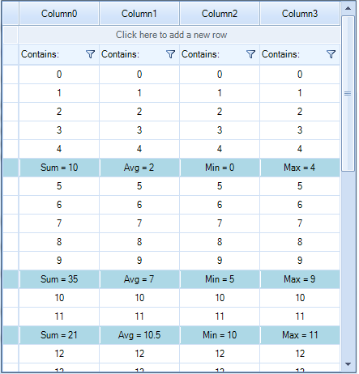

# Summary Rows

The purpose of this article is to demonstrate a sample approach how you can implement a scenario in which __RadVirtualGrid__ displays summary rows.

>caption Figure 1: Summary Rows




We will use a sample DataTable to populate the __RadVirtualGrid__ with data by using the __CellValueNeeded__ event. In a *List* of integer values, we will store the row indices at which the summary rows will be placed. Thus, in the __CellValueNeeded__ event for the specific row index that is related to a summary row, we will calculate the summary value. The __CellFormatting__ event will be used to apply different style for the summary cells. Finally, subscribe to the __CellValuePushed__ event where you should modify the *DataTable* value for the associated cell. In order to update the summary values, call the __RadVirtualGrid.TableElement.SynchronizeRows__ method.

You can find below a complete code snippet which result is illustrated on the above figure:

{{source=..\SamplesCS\VirtualGrid\HowTo\VirtualGridSummaryRows.cs region=SummaryRows}} 
{{source=..\SamplesVB\VirtualGrid\HowTo\VirtualGridSummaryRows.vb region=SummaryRows}}

````C#
        
private DataTable table = new DataTable();
private List<int> summaryRowIndices = new List<int>();
        
public VirtualGridSummaryRows()
{
    InitializeComponent();
    
    this.table = this.GenerateData();
    
    this.summaryRowIndices.AddRange(new int[] { 5, 11, 14, 20, 25, 35 });
    
    this.radVirtualGrid1.RowCount = table.Rows.Count + summaryRowIndices.Count;
    this.radVirtualGrid1.ColumnCount = table.Columns.Count;
    this.radVirtualGrid1.CellValueNeeded += VirtualGridElement_CellValueNeeded;
    this.radVirtualGrid1.CellValuePushed += VirtualGridElement_CellValuePushed;
    this.radVirtualGrid1.CellFormatting += radVirtualGrid1_CellFormatting;
}
        
private DataTable GenerateData()
{
    DataTable table = new DataTable();
    
    for (int i = 0; i < 4; i++)
    {
        table.Columns.Add("Column" + i, typeof(decimal));
    }
    
    for (int i = 0; i < 30; i++)
    {
        table.Rows.Add(i, i, i, i);
    }
    
    return table;
}
        
private void VirtualGridElement_CellValueNeeded(object sender, VirtualGridCellValueNeededEventArgs e)
{
    if (e.RowIndex < 0 && e.ColumnIndex >= 0)
    {
        if (e.RowIndex == RadVirtualGrid.HeaderRowIndex)
        {
            e.Value = table.Columns[e.ColumnIndex].ColumnName;
        }
    }
    else if (e.RowIndex >= 0 && e.ColumnIndex >= 0)
    {
        if (this.IsSummaryRow(e.RowIndex))
        {
            e.Value = this.GetSummaryValue(e.RowIndex, e.ColumnIndex);
        }
        else
        {
            e.Value = this.table.Rows[this.GetDataSourceRowIndex(e.RowIndex)][e.ColumnIndex];
        }
    }
}
        
private void radVirtualGrid1_CellFormatting(object sender, VirtualGridCellElementEventArgs e)
{
    if (this.IsSummaryRow(e.CellElement.RowIndex))
    {
        e.CellElement.BackColor = Color.LightBlue;
        e.CellElement.DrawFill = true;
        e.CellElement.GradientStyle = GradientStyles.Solid;
    }
    else
    {
        e.CellElement.ResetValue(LightVisualElement.BackColorProperty, ValueResetFlags.Local);
        e.CellElement.ResetValue(LightVisualElement.DrawFillProperty, ValueResetFlags.Local);
        e.CellElement.ResetValue(LightVisualElement.GradientStyleProperty, ValueResetFlags.Local);
    }
}
        
private void VirtualGridElement_CellValuePushed(object sender, VirtualGridCellValuePushedEventArgs e)
{
    this.table.Rows[this.GetDataSourceRowIndex(e.RowIndex)][e.ColumnIndex] = e.Value;
    this.radVirtualGrid1.TableElement.SynchronizeRows();
}
        
private bool IsSummaryRow(int virtualGridRowIndex)
{
    return this.summaryRowIndices.BinarySearch(virtualGridRowIndex) >= 0;
}
        
private int GetDataSourceRowIndex(int virtualGridRowIndex)
{
    int result = virtualGridRowIndex;
    
    for (int i = 0; i < this.summaryRowIndices.Count; i++)
    {
        if (virtualGridRowIndex >= this.summaryRowIndices[i])
        {
            result--;
        }
        else
        {
            break;
        }
    }
    
    return result;
}
        
private object GetSummaryValue(int virtualGridRowIndex, int virtualGridcolumnIndex)
{
    int index = this.summaryRowIndices.BinarySearch(virtualGridRowIndex);
    
    if (index < 0)
    {
        return null;
    }
    
    int startIndex = 0;
    int endIndex = 0;
    
    if (index == 0)
    {
        startIndex = 0;
        endIndex = this.summaryRowIndices[index] - 1;
    }
    else
    {
        startIndex = this.summaryRowIndices[index - 1] + 1;
        endIndex = this.summaryRowIndices[index] - 1;
    }
    
    startIndex = this.GetDataSourceRowIndex(startIndex);
    endIndex = this.GetDataSourceRowIndex(endIndex);
    
    return this.ExecuteSummaryFunction(startIndex, endIndex, virtualGridcolumnIndex);
}
        
private object ExecuteSummaryFunction(int startRowIndex, int endRowIndex, int columnIndex)
{
    switch (columnIndex)
    {
        case 0:
            decimal sum = 0;
            
            for (int i = startRowIndex; i <= endRowIndex; i++)
            {
                sum += (decimal)this.table.Rows[i][columnIndex];
            }
            
            return "Sum = " + sum;
        case 1:
            decimal avgSum = 0;
            
            for (int i = startRowIndex; i <= endRowIndex; i++)
            {
                avgSum += (decimal)this.table.Rows[i][columnIndex];
            }
            
            return "Avg = " + (avgSum / (endRowIndex - startRowIndex + 1));
        case 2:
            decimal min = int.MaxValue;
            
            for (int i = startRowIndex; i <= endRowIndex; i++)
            {
                min = Math.Min(min, (decimal)this.table.Rows[i][columnIndex]);
            }
            
            return "Min = " + min;
        case 3:
            decimal max = int.MinValue;
            
            for (int i = startRowIndex; i <= endRowIndex; i++)
            {
                max = Math.Max(max, (decimal)this.table.Rows[i][columnIndex]);
            }
            
            return "Max = " + max;
        default:
            return null;
    }
}

````
````VB.NET
Private table As New DataTable()
Private summaryRowIndices As New List(Of Integer)()
Public Sub New()
    InitializeComponent()
    Me.table = Me.GenerateData()
    Me.summaryRowIndices.AddRange(New Integer() {5, 11, 14, 20, 25, 35})
    Me.RadVirtualGrid1.RowCount = table.Rows.Count + summaryRowIndices.Count
    Me.RadVirtualGrid1.ColumnCount = table.Columns.Count
    AddHandler Me.RadVirtualGrid1.CellValueNeeded, AddressOf VirtualGridElement_CellValueNeeded
    AddHandler Me.RadVirtualGrid1.CellValuePushed, AddressOf VirtualGridElement_CellValuePushed
    AddHandler Me.RadVirtualGrid1.CellFormatting, AddressOf radVirtualGrid1_CellFormatting
End Sub
Private Function GenerateData() As DataTable
    Dim table As New DataTable()
    For i As Integer = 0 To 3
        table.Columns.Add("Column" & i, GetType(Decimal))
    Next
    For i As Integer = 0 To 29
        table.Rows.Add(i, i, i, i)
    Next
    Return table
End Function
Private Sub VirtualGridElement_CellValueNeeded(sender As Object, e As VirtualGridCellValueNeededEventArgs)
    If e.RowIndex < 0 AndAlso e.ColumnIndex >= 0 Then
        If e.RowIndex = RadVirtualGrid.HeaderRowIndex Then
            e.Value = table.Columns(e.ColumnIndex).ColumnName
        End If
    ElseIf e.RowIndex >= 0 AndAlso e.ColumnIndex >= 0 Then
        If Me.IsSummaryRow(e.RowIndex) Then
            e.Value = Me.GetSummaryValue(e.RowIndex, e.ColumnIndex)
        Else
            e.Value = Me.table.Rows(Me.GetDataSourceRowIndex(e.RowIndex))(e.ColumnIndex)
        End If
    End If
End Sub
Private Sub radVirtualGrid1_CellFormatting(sender As Object, e As VirtualGridCellElementEventArgs)
    If Me.IsSummaryRow(e.CellElement.RowIndex) Then
        e.CellElement.BackColor = Color.LightBlue
        e.CellElement.DrawFill = True
        e.CellElement.GradientStyle = GradientStyles.Solid
    Else
        e.CellElement.ResetValue(LightVisualElement.BackColorProperty, ValueResetFlags.Local)
        e.CellElement.ResetValue(LightVisualElement.DrawFillProperty, ValueResetFlags.Local)
        e.CellElement.ResetValue(LightVisualElement.GradientStyleProperty, ValueResetFlags.Local)
    End If
End Sub
Private Sub VirtualGridElement_CellValuePushed(sender As Object, e As VirtualGridCellValuePushedEventArgs)
    Me.table.Rows(Me.GetDataSourceRowIndex(e.RowIndex))(e.ColumnIndex) = e.Value
    Me.RadVirtualGrid1.TableElement.SynchronizeRows()
End Sub
Private Function IsSummaryRow(virtualGridRowIndex As Integer) As Boolean
    Return Me.summaryRowIndices.BinarySearch(virtualGridRowIndex) >= 0
End Function
Private Function GetDataSourceRowIndex(virtualGridRowIndex As Integer) As Integer
    Dim result As Integer = virtualGridRowIndex
    For i As Integer = 0 To Me.summaryRowIndices.Count - 1
        If virtualGridRowIndex >= Me.summaryRowIndices(i) Then
            result -= 1
        Else
            Exit For
        End If
    Next
    Return result
End Function
Private Function GetSummaryValue(virtualGridRowIndex As Integer, virtualGridcolumnIndex As Integer) As Object
    Dim index As Integer = Me.summaryRowIndices.BinarySearch(virtualGridRowIndex)
    If index < 0 Then
        Return Nothing
    End If
    Dim startIndex As Integer = 0
    Dim endIndex As Integer = 0
    If index = 0 Then
        startIndex = 0
        endIndex = Me.summaryRowIndices(index) - 1
    Else
        startIndex = Me.summaryRowIndices(index - 1) + 1
        endIndex = Me.summaryRowIndices(index) - 1
    End If
    startIndex = Me.GetDataSourceRowIndex(startIndex)
    endIndex = Me.GetDataSourceRowIndex(endIndex)
    Return Me.ExecuteSummaryFunction(startIndex, endIndex, virtualGridcolumnIndex)
End Function
Private Function ExecuteSummaryFunction(startRowIndex As Integer, endRowIndex As Integer, columnIndex As Integer) As Object
    Select Case columnIndex
        Case 0
            Dim sum As Decimal = 0
            For i As Integer = startRowIndex To endRowIndex
                sum += CDec(Me.table.Rows(i)(columnIndex))
            Next
            Return "Sum = " & sum
        Case 1
            Dim avgSum As Decimal = 0
            For i As Integer = startRowIndex To endRowIndex
                avgSum += CDec(Me.table.Rows(i)(columnIndex))
            Next
            Return "Avg = " & (avgSum / (endRowIndex - startRowIndex + 1))
        Case 2
            Dim min As Decimal = Integer.MaxValue
            For i As Integer = startRowIndex To endRowIndex
                min = Math.Min(min, CDec(Me.table.Rows(i)(columnIndex)))
            Next
            Return "Min = " & min
        Case 3
            Dim max As Decimal = Integer.MinValue
            For i As Integer = startRowIndex To endRowIndex
                max = Math.Max(max, CDec(Me.table.Rows(i)(columnIndex)))
            Next
            Return "Max = " & max
        Case Else
            Return Nothing
    End Select
End Function

```` 

{{endregion}}

# See Also

* [Formatting Data Cells]()
* [Populating with Data]()
 
