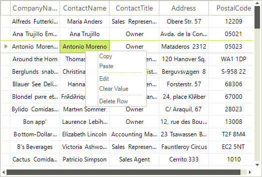
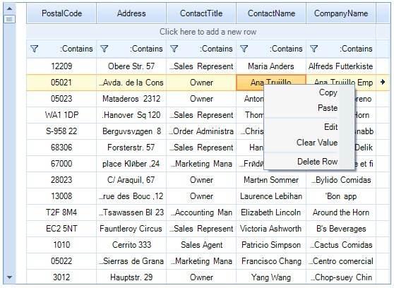

# Rigth-To-Left Support

__RadVirtualGrid__ fully supports right-to-left (RTL) language locales. You can enable/disable the right-to-left layout by setting the __RightToLeft__ property. The __RightToLeft__ enumeration has the following members:

* *Yes*: Content is aligned from right to left.

* *No*: Content is aligned from left to right.

* *Inherit*: Direction will be determined by the parent control.

|RightToLeft.No|RightToLeft.Yes|
|----|----|
|||

# See Also
* [Localization]()

