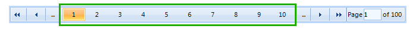
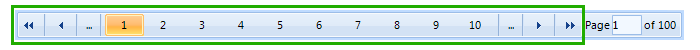
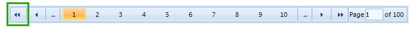
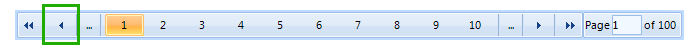
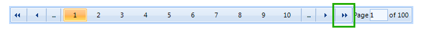

# Paging panel

When paging is enabled in __RadVirtualGrid__, a panel is added to the bottom of the grid view element. It allows users to navigate back and forth over the pages or jump directly to a desired page. 

There are a number of properties, which allow you to customize the paging panel to your specific needs. You can access these properties through the __RadVirtualGrid.TableElement.PagingPanelElement__. Here is what options you have:

* __NumericButtonsCount:__ Controls how many buttons for navigation to concrete pages there are on the panel. 

* __ShowButtonsStripElement:__ Controls whether the buttons panel is visible. 

* __ShowFirstButton:__ Controls whether the button navigating to the first page is visible. 

* __ShowPreviousButton:__ Controls whether the button navigating to the previous page is visible. 

* __ShowFastBackButton:__ Controls whether the button with three dots is visible. This button moves the grid back X number of pages, where X equals the number of numeric buttons. 

* __ShowFastForwardButton:__ Controls whether the button with three dots is visible. This button moves the grid forth X number of pages, where X equals the number of numeric buttons. 

* __ShowNextButton:__ Controls whether the button navigating to the next page is visible. 

* __ShowLastButton__ Controls whether the button navigating to the last page is visible. 

* __ShowNumericalButtons:__ Controls whether the buttons navigating to concrete pages are visible. 

* __ShowTextBoxStripElement:__ Controls whether the panel allowing users to jump to a concrete page is visible. 