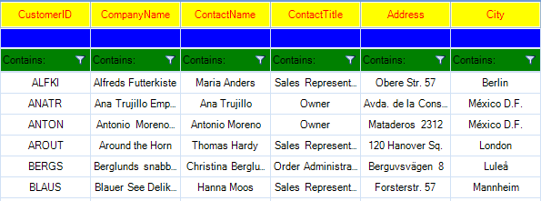

# Formatting System Rows

The __RowFormatting__ event is used to add formatting to grid systems rows: header row, filter row and new row. Depending on the __RowIndex__, you can distinguish the system rows:

|RowIndex|VirtualGridRowElement|
|----|----|
|-1|VirtualGridHeaderRowElement|
|-2|VirtualGridNewRowElement|
|-3|VirtualGridFilterRowElement|

>note This would not work properly if the styles of the cells are explicitly set in the theme. For example the TelerikMetro theme explicitly sets the styles of the HeaderRow cells. 




{{source=..\SamplesCS\VirtualGrid\Rows\VirtualGridFormattingRows.cs region=SystemRowsFormatting}} 
{{source=..\SamplesVB\VirtualGrid\Rows\VirtualGridFormattingRows.vb region=SystemRowsFormatting}} 

````C#
        
private void radVirtualGrid_RowFormatting(object sender, VirtualGridRowElementEventArgs e)
{
    if (e.RowElement.RowIndex == -1)  //format header row
    {
        e.RowElement.DrawFill = true;
        e.RowElement.BackColor = Color.Yellow;
        e.RowElement.GradientStyle = Telerik.WinControls.GradientStyles.Solid;
        e.RowElement.ForeColor = Color.Red;
    }
    else if (e.RowElement.RowIndex == -2)//format new row
    {
        e.RowElement.DrawFill = true;
        e.RowElement.BackColor = Color.Blue;
        e.RowElement.GradientStyle = Telerik.WinControls.GradientStyles.Solid;
        e.RowElement.ForeColor = Color.Aqua;
    }
    else if (e.RowElement.RowIndex == -3)//format filter row
    {
        e.RowElement.DrawFill = true;
        e.RowElement.BackColor = Color.Green ;
        e.RowElement.GradientStyle = Telerik.WinControls.GradientStyles.Solid;
        e.RowElement.ForeColor = Color.Black ;
    }
    else
    {
        e.RowElement.ResetValue(LightVisualElement.DrawFillProperty, ValueResetFlags.Local);
        e.RowElement.ResetValue(LightVisualElement.BackColorProperty, ValueResetFlags.Local);
        e.RowElement.ResetValue(LightVisualElement.GradientStyleProperty, ValueResetFlags.Local);
        e.RowElement.ResetValue(LightVisualElement.ForeColorProperty, ValueResetFlags.Local);
    }
}

````
````VB.NET
Private Sub radVirtualGrid_RowFormatting(sender As Object, e As VirtualGridRowElementEventArgs)
    If e.RowElement.RowIndex = -1 Then
        'format header row
        e.RowElement.DrawFill = True
        e.RowElement.BackColor = Color.Yellow
        e.RowElement.GradientStyle = Telerik.WinControls.GradientStyles.Solid
        e.RowElement.ForeColor = Color.Red
    ElseIf e.RowElement.RowIndex = -2 Then
        'format new row
        e.RowElement.DrawFill = True
        e.RowElement.BackColor = Color.Blue
        e.RowElement.GradientStyle = Telerik.WinControls.GradientStyles.Solid
        e.RowElement.ForeColor = Color.Aqua
    ElseIf e.RowElement.RowIndex = -3 Then
        'format filter row
        e.RowElement.DrawFill = True
        e.RowElement.BackColor = Color.Green
        e.RowElement.GradientStyle = Telerik.WinControls.GradientStyles.Solid
        e.RowElement.ForeColor = Color.Black
    Else
        e.RowElement.ResetValue(LightVisualElement.DrawFillProperty, ValueResetFlags.Local)
        e.RowElement.ResetValue(LightVisualElement.BackColorProperty, ValueResetFlags.Local)
        e.RowElement.ResetValue(LightVisualElement.GradientStyleProperty, ValueResetFlags.Local)
        e.RowElement.ResetValue(LightVisualElement.ForeColorProperty, ValueResetFlags.Local)
    End If
End Sub

````

{{endregion}} 

>caution Due to the UI virtualization in __RadVirtualGrid__, row elements are created only for currently visible rows and are being reused during operations like scrolling, filtering, sorting and so on. In order to prevent applying the formatting to other columns' row elements (because of the row reuse) all customization should be reset for the rest of the row elements.
