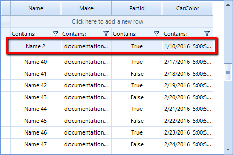

# Pinned Rows

__RadVirtualGrid__ rows can be pinned so that the rows appear anchored to the top or bottom of the grid. To pin a row you should use the __SetRowPinPosition__ method where you just need to pass the row index and the desired pin position.

{{source=..\SamplesCS\VirtualGrid\pinned-cells-rows.cs region=PinRow}} 
{{source=..\SamplesVB\VirtualGrid\pinned-cells-rows.vb region=PinRow}}
````C#
            
radVirtualGrid1.VirtualGridElement.SetRowPinPosition(2, PinnedRowPosition.Top);

````
````VB.NET
radVirtualGrid1.VirtualGridElement.SetRowPinPosition(2, PinnedRowPosition.Top)

```` 

{{endregion}}


The result is that the row is pined bellow the filter row.



To unpin a row you just need to set its pin position to *none*.

{{source=..\SamplesCS\VirtualGrid\pinned-cells-rows.cs region=UnpinRow}} 
{{source=..\SamplesVB\VirtualGrid\pinned-cells-rows.vb region=UnpinRow}}
````C#
        
radVirtualGrid1.VirtualGridElement.SetRowPinPosition(2, PinnedRowPosition.None);

````
````VB.NET
radVirtualGrid1.VirtualGridElement.SetRowPinPosition(2, PinnedRowPosition.None)

```` 

{{endregion}}
   
   
