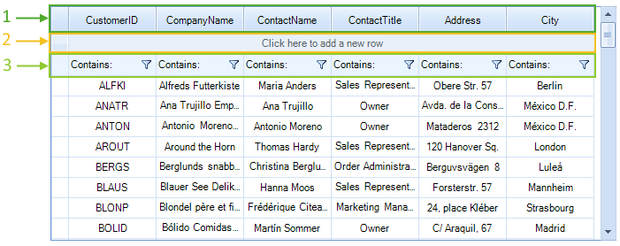

# System Rows

__RadVirtualGrid__ has three system rows.

1. 	__VirtualGridHeaderRowElement__: Displays the columns header text.
2. 	__VirtualGridNewRowElement__: Allows the end user to add a row.
3. 	__VirtualGridFilterRowElement__: Displays the filter popup and the applied descriptors.

__RadVirtualGrid__ and its master view info expose properties defining whether or not a particular row will be displayed. The default value for each of the properties is *true*.

* __RadVirtualGrid.ShowHeaderRow__

* __RadVirtualGrid.AllowAddNewRow__

* __RadVirtualGrid1.MasterViewInfo.ShowFilterRow__

The system rows can be resized to a particular height: [Resizing Rows Programmatiacally]().

