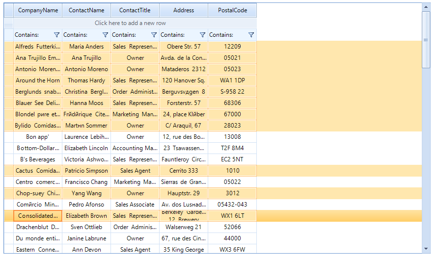

# Multiple Selection

__RadVirtualGrid__ allows the user to select more than one item at a time from the displayed data. By default, this functionality is disabled and in order to turn it on, you have to set the __MultiSelect__ property to *true*.

## Multiple Row Selection

In order to enable multiple row selection, after setting the __MultiSelect__ property to *true*, you have to set the __SelectionMode__ to __FullRowSelect__:

{{source=..\SamplesCS\VirtualGrid\VirtualGridSelection.cs region=multiSelect}} 
{{source=..\SamplesVB\VirtualGrid\VirtualGridSelection.vb region=multiSelect}}
````C#
            
radVirtualGrid1.MultiSelect = true;
radVirtualGrid1.SelectionMode = VirtualGridSelectionMode.FullRowSelect;

````
````VB.NET
radVirtualGrid1.MultiSelect = True
radVirtualGrid1.SelectionMode = VirtualGridSelectionMode.FullRowSelect

```` 

{{endregion}}

When these settings are applied, you have several options to make a multiple selection:
* Press Ctrl + A to select all rows.
* Hold the __Ctrl__ key and click the rows that you want to select.
* In order to mark a block selection, mark the first row of the desired selection, hold __Shift__ and click on the last row of the desired selection.




## Multiple Cell Selection

In order to enable multiple cell selection, after setting the __MultiSelect__ property to true, you have to set the __SelectionMode__ to __CellSelect__:

{{source=..\SamplesCS\VirtualGrid\VirtualGridSelection.cs region=multiCell}} 
{{source=..\SamplesVB\VirtualGrid\VirtualGridSelection.vb region=multiCell}}
````C#
  
radVirtualGrid1.MultiSelect = true;
radVirtualGrid1.SelectionMode = VirtualGridSelectionMode.CellSelect;

````
````VB.NET
radVirtualGrid1.MultiSelect = True
radVirtualGrid1.SelectionMode = VirtualGridSelectionMode.CellSelect

```` 

{{endregion}}

Once you have applied these setting, the options for selection are:

* Press __Ctrl__ + __A__ to select all cells.
* Holding the __Ctrl__ key and click the cells that you want to select.
* In order to mark a block selection, mark the first cell of the desired selection, hold __Shift__ and click on the last cell of the desired selection. Please note that this will select all the cells in the rectangle between the first and the second selected cell.


