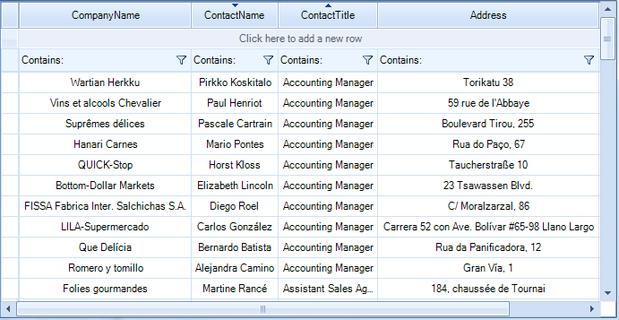

# Setting Sorting Programmatically

__RadVirtualGrid__ includes __SortDescriptors__ property. This collection allows you to use descriptors which define the sorting property and the sorting direction.

>caution Before proceeding with this article, please refer to the [Sorting Overview]() article which demonstrates how to fill data in __RadVirtualGrid__.

Here is how to create and add two __SortDescriptors__. The __PropertyName__ property defines the property, by which the data will be sorted, and the __SortDirection__ property allows you to define the sort direction.



#### Using SortDescriptor 

{{source=..\SamplesCS\VirtualGrid\Sorting\VirtualGridSorting.cs region=RunTimeSorting}} 
{{source=..\SamplesVB\VirtualGrid\Sorting\VirtualGridSorting.vb region=RunTimeSorting}}

````C#
SortDescriptor descriptorContactTitle = new SortDescriptor();
descriptorContactTitle.PropertyName = "ContactTitle";
descriptorContactTitle.Direction = ListSortDirection.Ascending;
SortDescriptor descriptorContactName = new SortDescriptor();
descriptorContactName.PropertyName = "ContactName";
descriptorContactName.Direction = ListSortDirection.Descending;
this.radVirtualGrid1.SortDescriptors.Add(descriptorContactTitle);
this.radVirtualGrid1.SortDescriptors.Add(descriptorContactName);

````
````VB.NET
Dim descriptorContactTitle As New SortDescriptor()
descriptorContactTitle.PropertyName = "ContactTitle"
descriptorContactTitle.Direction = ListSortDirection.Ascending
Dim descriptorContactName As New SortDescriptor()
descriptorContactName.PropertyName = "ContactName"
descriptorContactName.Direction = ListSortDirection.Descending
Me.RadVirtualGrid1.SortDescriptors.Add(descriptorContactTitle)
Me.RadVirtualGrid1.SortDescriptors.Add(descriptorContactName)

```` 

{{endregion}}

>note The RadVirtualGrid.__AllowMultiColumnSorting__ property should be set to *true* in order to achieve multiple columns sorting. Otherwise, __RadVirtualGrid__ will be sorted by a single column.

# See Also
* [Sorting Overview]()

