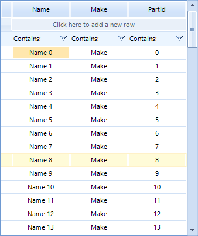

# Getting Started

The example bellow demonstrates how one can use __RadVirtualGrid__ with a list which contains large amount of data. The example shows how you can use the control events to add or remove rows as well.



>note In order to use __RadVirtualGrid__ you should add reference to the __Telerik.WinControls.GridView__ assembly.
>

### Setting the form and adding data 
 
1\. Add a __RadVirtualGrid__ to a form and set its __Dock__ property to __Fill__ .
2\. Add the following sample class to the project.

{{source=..\SamplesCS\VirtualGrid\VirtualGridGettingStarted.cs region=SampleClass}} 
{{source=..\SamplesVB\VirtualGrid\VirtualGridGettingStarted.vb region=SampleClass}}
````C#
        
public class CarPart
{
    public string Name { get; set; }
                
    public string Make { get; set; }
                
    public int PartID { get; set; }
                
    public string this[int i]
    {
        get
        {
            switch (i)
            {
                case 0:
                    return Name;
                case 1:
                    return Make;
                case 2:
                    return PartID.ToString();
                default:
                    return string.Empty;
            }
        }
    }
}

````
````VB.NET
Public Class CarPart
    Public Property Name() As String
    Public Property Make() As String
    Public Property PartID() As Integer
    Default Public ReadOnly Property Item(ByVal i As Integer) As String
        Get
            Select Case i
                Case 0
                    Return Name
                Case 1
                    Return Make
                Case 2
                    Return PartID.ToString()
                Case Else
                    Return String.Empty
            End Select
        End Get
    End Property
End Class

```` 

{{endregion}}

3\. Now you can create the list of objects which will be used as data source. In addition you can create an array that contains the column names.

{{source=..\SamplesCS\VirtualGrid\VirtualGridGettingStarted.cs region=CreateData}} 
{{source=..\SamplesVB\VirtualGrid\VirtualGridGettingStarted.vb region=CreateData}}
````C#
        
List<CarPart> data = new List<CarPart>();
private string[] columnNames = new string[]
{
    "Name",
    "Make",
    "PartId"
};
        
public VirtualGridGettingStarted()
{
    InitializeComponent();
    for (int i = 0; i < 1000000; i++)
    {
        data.Add(new CarPart()
        {
            Name = "Name " + i,
            Make = "Tesla",
            PartID = i
        });
    }
}

````
````VB.NET
Private data As New List(Of CarPart)()
Private columnNames() As String = {"Name", "Make", "PartId"}
Public Sub New()
    InitializeComponent()
    For i As Integer = 0 To 999999
        data.Add(New CarPart() With {
            .Name = "Name " & i,
            .Make = "Tesla",
            .PartID = i
        })
    Next i
End Sub

```` 

{{endregion}}

### Using the virtual grid

1\. To use the grid you should first specify the the count of columns and rows. In addition, you should subscribe to the __CellValueNeeded__ and __CellValuePushed__ events which are used for populating the grid with data and updating the data source when values are changed:

{{source=..\SamplesCS\VirtualGrid\VirtualGridGettingStarted.cs region=InitGrid}} 
{{source=..\SamplesVB\VirtualGrid\VirtualGridGettingStarted.vb region=InitGrid}}
````C#
            
radVirtualGrid1.CellValueNeeded += RadVirtualGrid1_CellValueNeeded;
radVirtualGrid1.CellValuePushed += RadVirtualGrid1_CellValuePushed;
radVirtualGrid1.ColumnCount = columnNames.Length;
radVirtualGrid1.RowCount = data.Count;

````
````VB.NET
AddHandler radVirtualGrid1.CellValueNeeded, AddressOf RadVirtualGrid1_CellValueNeeded
AddHandler radVirtualGrid1.CellValuePushed, AddressOf RadVirtualGrid1_CellValuePushed
radVirtualGrid1.ColumnCount = columnNames.Length
radVirtualGrid1.RowCount = data.Count

```` 

{{endregion}}

2\. Now you can add the __CellValueNeeded__ event handler. In it we will retrieve the cell value and pass it to the grid according to the current row/column index. The event is fired for the header row so you can set the header cells text as well.

{{source=..\SamplesCS\VirtualGrid\VirtualGridGettingStarted.cs region=SetValue}} 
{{source=..\SamplesVB\VirtualGrid\VirtualGridGettingStarted.vb region=SetValue}}
````C#
        
private void RadVirtualGrid1_CellValueNeeded(object sender, VirtualGridCellValueNeededEventArgs e)
{
    if (e.ColumnIndex < 0)
        return;
        
    if (e.RowIndex == RadVirtualGrid.HeaderRowIndex)
    {
        e.Value = columnNames[e.ColumnIndex];
    }
    if (e.RowIndex >= 0 && e.RowIndex < data.Count)
    {
        e.Value = data[e.RowIndex][e.ColumnIndex];
    }
}

````
````VB.NET
Private Sub RadVirtualGrid1_CellValueNeeded(ByVal sender As Object, ByVal e As VirtualGridCellValueNeededEventArgs)
    If e.ColumnIndex < 0 Then
        Return
    End If
    If e.RowIndex = RadVirtualGrid.HeaderRowIndex Then
        e.Value = columnNames(e.ColumnIndex)
    End If
    If e.RowIndex >= 0 AndAlso e.RowIndex < data.Count Then
        e.Value = data(e.RowIndex)(e.ColumnIndex)
    End If
End Sub

```` 

{{endregion}}

3\. When a cell value is changed the __CellValuePushed__ event will fire. This will allow you to update the value in the data source:

{{source=..\SamplesCS\VirtualGrid\VirtualGridGettingStarted.cs region=UpdateValue}} 
{{source=..\SamplesVB\VirtualGrid\VirtualGridGettingStarted.vb region=UpdateValue}}
````C#
            
private void RadVirtualGrid1_CellValuePushed(object sender, VirtualGridCellValuePushedEventArgs e)
{
    switch (e.ColumnIndex)
    {
        case 0:
            data[e.RowIndex].Name = e.Value.ToString();
            break;
        case 1:
            data[e.RowIndex].Make = e.Value.ToString();
            break;
        case 2:
            data[e.RowIndex].PartID = Convert.ToInt32(e.Value.ToString());
            break;
        default:
            break;
    }
}

````
````VB.NET
Private Sub RadVirtualGrid1_CellValuePushed(ByVal sender As Object, ByVal e As VirtualGridCellValuePushedEventArgs)
    Select Case e.ColumnIndex
        Case 0
            data(e.RowIndex).Name = e.Value.ToString()
        Case 1
            data(e.RowIndex).Make = e.Value.ToString()
        Case 2
            data(e.RowIndex).PartID = Convert.ToInt32(e.Value.ToString())
        Case Else
    End Select
End Sub

```` 

{{endregion}}

### Add or remove rows

By default the end user can add or remove rows with the UI. When such operation is performed the __UserAddedRow__ or __UserDeletingRow__ events will fire. 

>note The user can delete multiple rows at once.
>

The following example shows how you can handle the above events and properly update the data source.
{{source=..\SamplesCS\VirtualGrid\VirtualGridGettingStarted.cs region=AddRemove}} 
{{source=..\SamplesVB\VirtualGrid\VirtualGridGettingStarted.vb region=AddRemove}}
````C#
        
private void RadVirtualGrid1_UserAddedRow(object sender, VirtualGridNewRowEventArgs e)
{
    data.Add(new CarPart()
    {
        Name = e.NewValues[0].ToString(),
        Make = e.NewValues[1].ToString(),
        PartID = Convert.ToInt32(e.NewValues[2].ToString())
    });
}
private void RadVirtualGrid1_UserDeletedRow(object sender, VirtualGridRowsEventArgs e)
{
    var indexesToRemove = e.RowIndices.ToList();
    
    for (int i = indexesToRemove.Count - 1; i >= 0; i--)
    {
        data.RemoveAt(indexesToRemove[i]);
    }
}

````
````VB.NET
Private Sub RadVirtualGrid1_UserAddedRow(ByVal sender As Object, ByVal e As VirtualGridNewRowEventArgs)
    data.Add(New CarPart() With {
        .Name = e.NewValues(0).ToString(),
        .Make = e.NewValues(1).ToString(),
        .PartID = Convert.ToInt32(e.NewValues(2).ToString())
    })
End Sub
Private Sub RadVirtualGrid1_UserDeletedRow(ByVal sender As Object, ByVal e As VirtualGridRowsEventArgs)
    Dim indexesToRemove = e.RowIndices.ToList()
    For i As Integer = indexesToRemove.Count - 1 To 0 Step -1
        data.RemoveAt(indexesToRemove(i))
    Next i
End Sub

```` 

{{endregion}}

