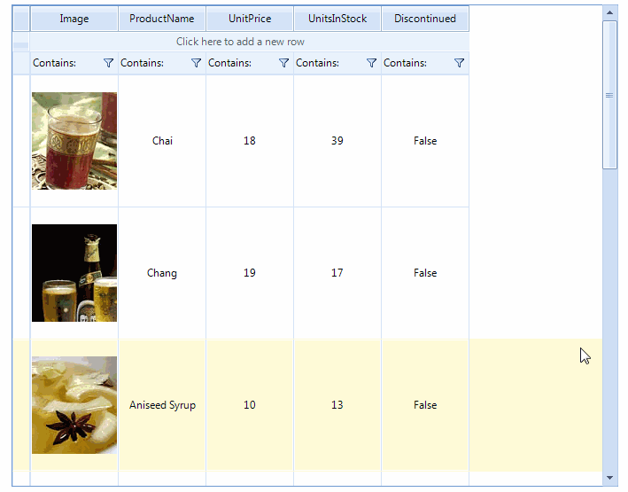

# RadVirtualGrid

__RadVirtualGrid__ is a grid component developed on top of Telerik Presentation Framework which provides a convenient way to implement your own data management operations and optimizes the performance when interacting with large amounts of data.

 

## Key features

* Easily customizable appearance and theming mechanism
* Outstanding performance
* Editing mechanism
* Hierarchical data presentation
* Sorting
* Filtering
* Paging
* Selection and navigation
* Flexible API

 

# See Also
* [Busy Indicators]()

* [Copy/Paste/Cut]()

* [Scrolling]()

* [Getting Started]()

