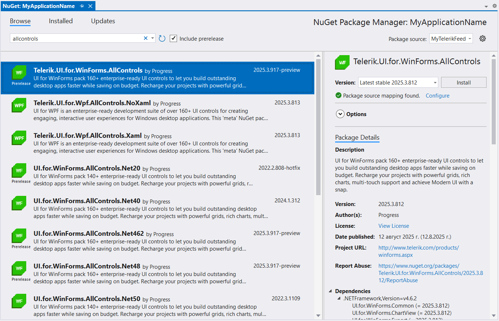

# Available NuGet Packages

Telerik UI for WinForms comes with several different packages that can be [installed in your project as NuGet packages]():

* [`Telerik.UI.for.WinForms.AllControls`](#full-package-telerikuiforwinformsallcontrols-recommended): one full distribution package
* [Separate packages per control or assembly](#separate-packages).

>important Starting with **Q3 2026**, all Telerik UI for WinForms NuGet packages are also available on <a href="https://www.nuget.org/" target="_blank">NuGet.org</a>. If you use NuGet.org, you do not need to configure the Telerik NuGet server.

## Full Package: Telerik.UI.for.WinForms.AllControls (recommended)

The `Telerik.UI.for.WinForms.AllControls` package contains all Telerik UI for WinForms assemblies and supports all available [Telerik .NET Distributions](). Once installed, the `Telerik.UI.for.WinForms.AllControls` package automatically detects the project's target framework and uses the corresponding Telerik assemblies.

>important The `Telerik.UI.for.WinForms.AllControls` package replaces the framework-specific packages which are already retired:
>
>* `UI.for.WinForms.AllControls.Net462`
>* `UI.for.WinForms.AllControls.Net48`
>* `UI.for.WinForms.AllControls.Net80`
>* `UI.for.WinForms.AllControls.Net90`

## Separate Packages

`Telerik_UI_for_WinForms_<version number>_NuGet_Dev.zip` contains `.nupkg` files for the separate packages for each Telerik assembly:

* `Telerik.for.WinForms.Common`
* `Telerik.for.WinForms.GridView`
* `Telerik.for.WinForms.PdfViewer`
* `Telerik.for.WinForms.Scheduler`
* `Telerik.for.WinForms.Theme`
* `Telerik.for.WinForms.SyntaxEditor`
*  .etc

## See Also

* [Installing On Your Computer]()
* [How to Upgrade a Telerik UI for WinForms Project]()
* [Restore Telerik NuGet packages in CI with API keys]()
