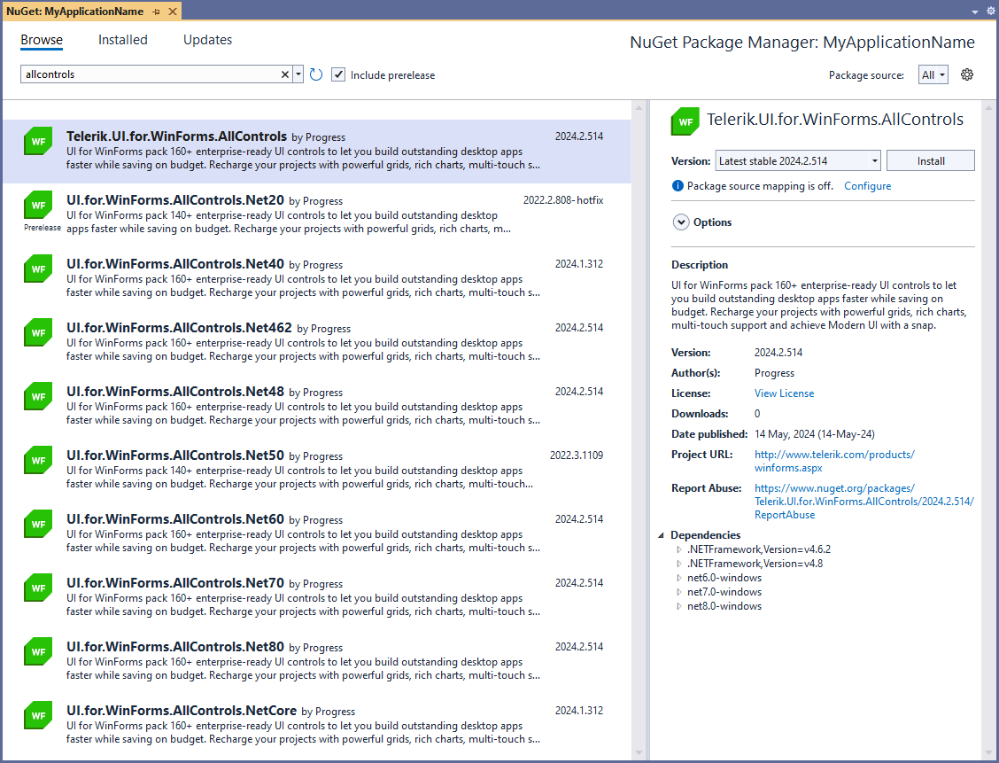

# Available NuGet Packages

Telerik UI for WinForms comes with a several different packages that can be [installed via the Telerik server or from a local package source]():

The Telerik assemblies are built against [different versions]() of .NET starting from .NET 4 to the latest official .NET. You should pick up this version of the NuGet package to install in your project that corresponds to the Target Framework that you are using in your project and that is available on your computer. 

>important The last NuGet package for .NET 2.0 is version 2022.2.622. 

## Full Packages

`Telerik_UI_for_WinForms_<version number>_NuGet_Dev.zip` contains `.nupkg` files for the following full packages:

* `UI.for.WinForms.AllControls.Net40`
* `UI.for.WinForms.AllControls.Net48`
* `UI.for.WinForms.AllControls.Net60`
* `UI.for.WinForms.AllControls.Net70`
* `UI.for.WinForms.AllControls.NetCore`

Each of these packages contains all Telerik UI for WinForms assemblies for the corresponding .NET framework/ .NET Core/ .NET version. 

## Separate Packages

`Telerik_UI_for_WinForms_<version number>_NuGet_Dev.zip` contains `.nupkg` files for the separate packages for each Telerik assembly:

* `UI.for.WinForms.Common`
* `UI.for.WinForms.GridView`
* `UI.for.WinForms.PdfViewer`
* `UI.for.WinForms.Scheduler`
* `UI.for.WinForms.Theme`
* `UI.for.WinForms.SyntaxEditor`
*  .etc

Each of these packages contain the corresponding Telerik dll for all available .NET frameworks (.40, .45, 4.8, etc.), .NET Core versions (3.0, 3.1, etc.), .NET 5.0, 6.0, 7.0 or newer . In case the dll is dependent on another Telerik dll, the required package will be installed automatically.

>note As the AllControls package contains all UI controls and themes it should not be installed in projects having other packages containing the UI controls (e.g. UI.for.WinForms.Common etc.) or the UI.for.WinForms.Themes package. Either use the AllControls package or the packages of the separate controls and the themes.

## Telerik NuGet Server Packages

There is an [online package source]() that can be used to get Telerik NuGets. 

## Installing Latest Internal Build NuGet Packages

You can install and test the [Latest Internal Build]() (LIB) dlls provided on a occasional basis, via the NuGet Package Manager. 

The LIB NuGets are available only as .nupkg files that can be downloaded from your telerik.com account as well: 

# See Also

* [Installing On Your Computer]()
* [How to Upgrade a Telerik UI for WinForms Project]()
* [Install NuGet Key]()
