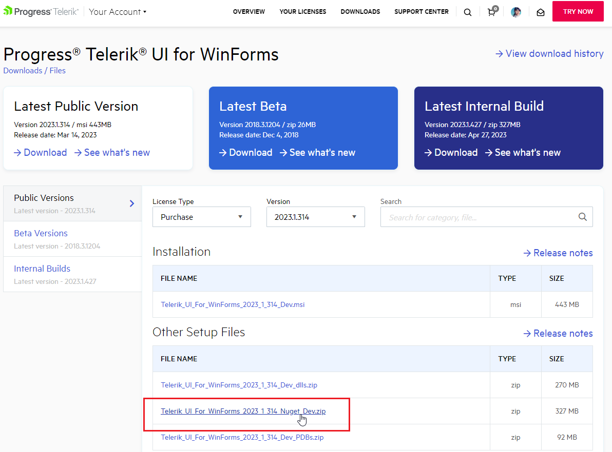
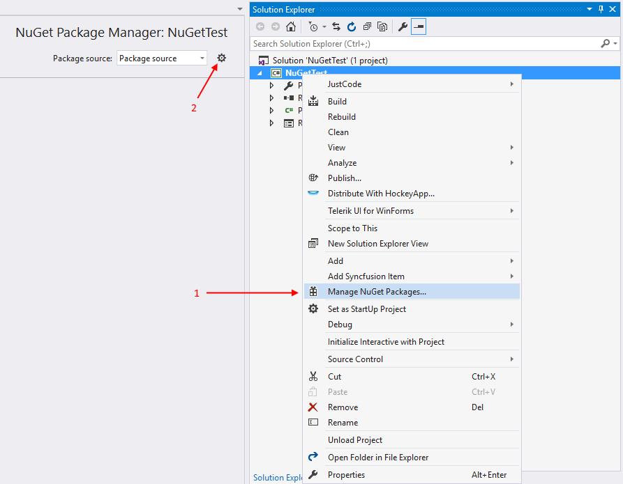
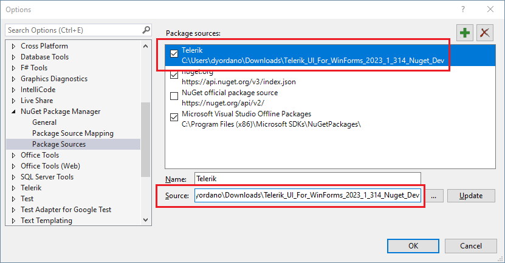
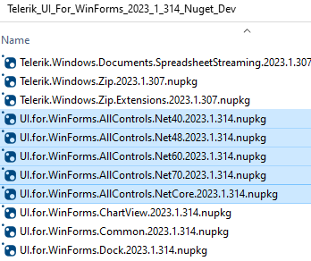
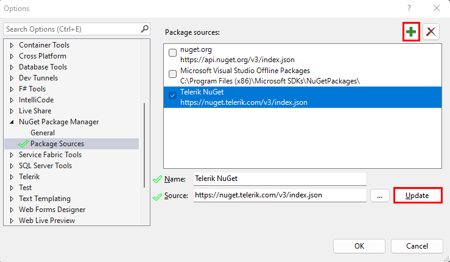
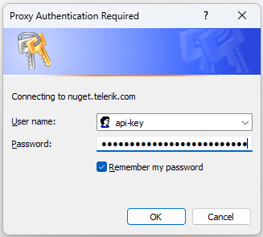
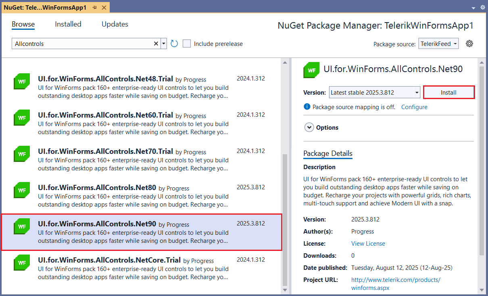
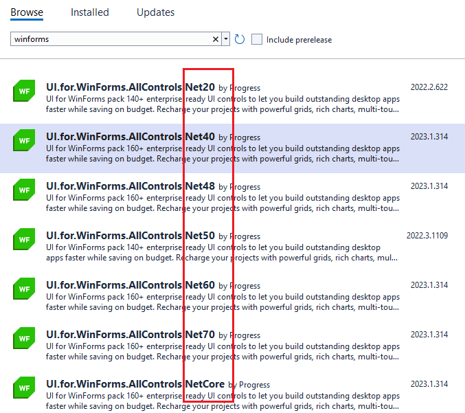

# Install using NuGet Packages

<iframe width="800" height="400" src="https://www.youtube.com/embed/c3m_BLMXNDk" frameborder="0" allow="accelerometer; autoplay; encrypted-media; gyroscope; picture-in-picture" allowfullscreen></iframe>

This article describes how you can install the WinForms suite using a NuGet package. There are two ways for getting the NuGet packages:

* [Manually download the packages](#manually-download-nuget-packages)

* [Get the packages from the Telerik NuGet server](#download-from-the-nuget-server)

## Manually Download NuGet Packages

1. First you need to log in using your licensed account. This way you will be able to download the packages:

	

	>tip The following article shows where you can find the downloads section [Download Product Files](https://docs.telerik.com/devtools/winforms/installation-and-upgrades/download-product-files)
	
1. Then you need to add packages to Visual Studio. Open the NuGet manager and then click the options button:
	
	

1. Add new package source. The __Source__ should point to the folder with the NuGets:
	
	

1. The final step is to select and install the desired packages. Please note that there are several versions, corresponding to the target framework used in the project, one for .NET 4.0, one for 4.8, one for .NET 6.0 or newer. 

	

## Download from the NuGet server

You need to add the Telerik package server (**https://nuget.telerik.com/v3/index.json**) to the package sources in visual studio.

>caution The old **https://nuget.telerik.com/nuget** server will be deprecated and we encourage our clients to switch to the v3 API. The new v3 API is faster, lighter, and reduces the number of requests from NuGet clients.  

1. First open the __Options__ window: 

	

1. Add new source and add the server to the Source field:

	

1. When the __Package Source__ is selected you will be prompted for a user name and a password. Use the credentials for your Telerik Account:

	

1. Then you can just select and install the desired NuGet packages.

    

It is necessary to choose this Nuget package which corresponds to the respective [target framework]() selected in your project:

   

# See Also

* [Installing On Your Computer]()
* [How to Upgrade a Telerik UI for WinForms Project]()
* [Install NuGet Key]()
