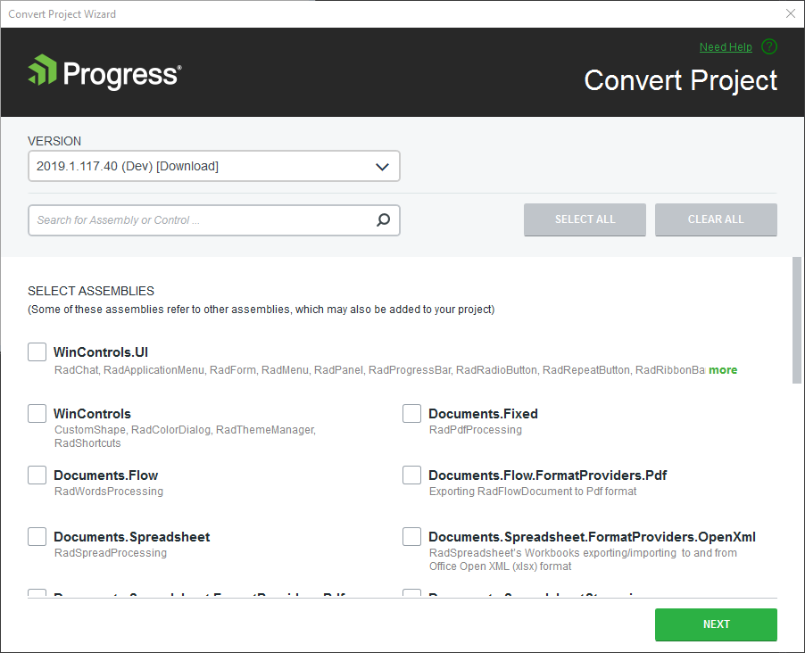

# Automatic dependency resolving

## 

To improve the experience of your clients and reduce your application’s size it is crucial to use only the subset of the Telerik UI for WinForms assemblies you really need.

Some controls require multiple assemblies and mistakes are not unlikely to happen. For example, in the urge to optimize, you could remove an assembly the project needs, thus breaking the application compilation.

When using the __Convert Project Wizard__ or __Project Configuration Wizard__, the possibility to make such mistakes is lowered to a minimum, thanks to the dependency analysis in the Visual Studio Extensions. 

The VSExtensions assembly list control is controlled by the dependency analyzer, which won’t let you select Telerik UI for WinForms assemblies without selecting the assemblies they depend on. Both the aspects are covered:

* Selecting a Telerik UI for WinForms assembly will automatically select the additional assemblies it depends on as well.

* Deselecting a Telerik UI for WinForms assembly will deselect assemblies depending on it along with it.

>tip Note that not all assemblies are listed.