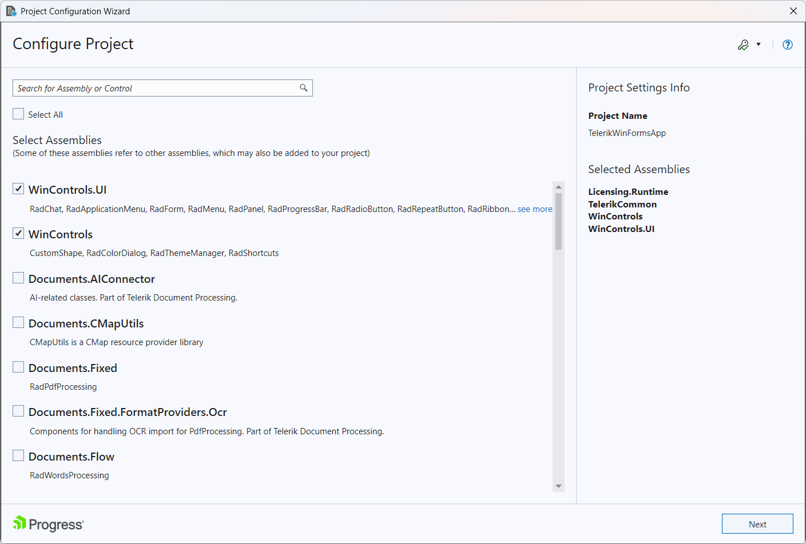
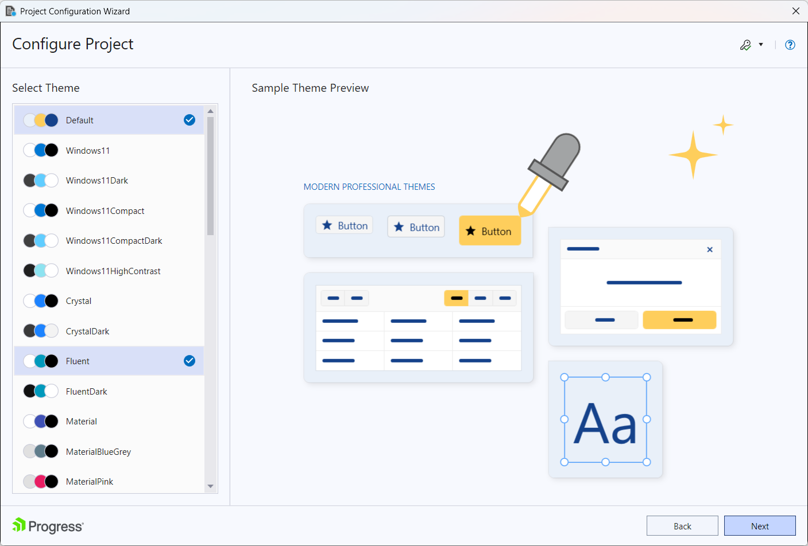

# Visual Studio Extensions

__Configure Telerik WinForms Application__

You can access the Project Configuration Wizard through the Telerik menu when you need to configure your Telerik WinForms application:

The wizard could be also reached through the context menu counterparts accessed by right clicking on the project you want to convert.

The Project Configuration Wizard’s first page lets you:

* Specify which assemblies your project would use. When selecting a UI for WinForms assembly all dependent controls are selected automatically and vice-versa.

Through the Project Configuration Wizard’s second page you can:

* Select which theme will be applied to your project. Check the content of each theme or see the preview of it when select it into the Project Configuration Wizard.

Through the Project Configuration Wizard’s third page you can:

* Select the "Enable HDPI" option in order to add support for high DPI awareness in your application.

>important Note that the "Enable HDPI" option is availaible from version 2019.1
When you click the Finish button:

* The selected assembly references get added to your project

* A default application-wide theme gets set according to the selected theme.

* An app.manifest file is included to your project if you have selected the "Enable HDPI" option.

# See Also

 * [Automatic Dependency Resolving]()

 * [Upgrade Project]()

 * [Download New Version]()