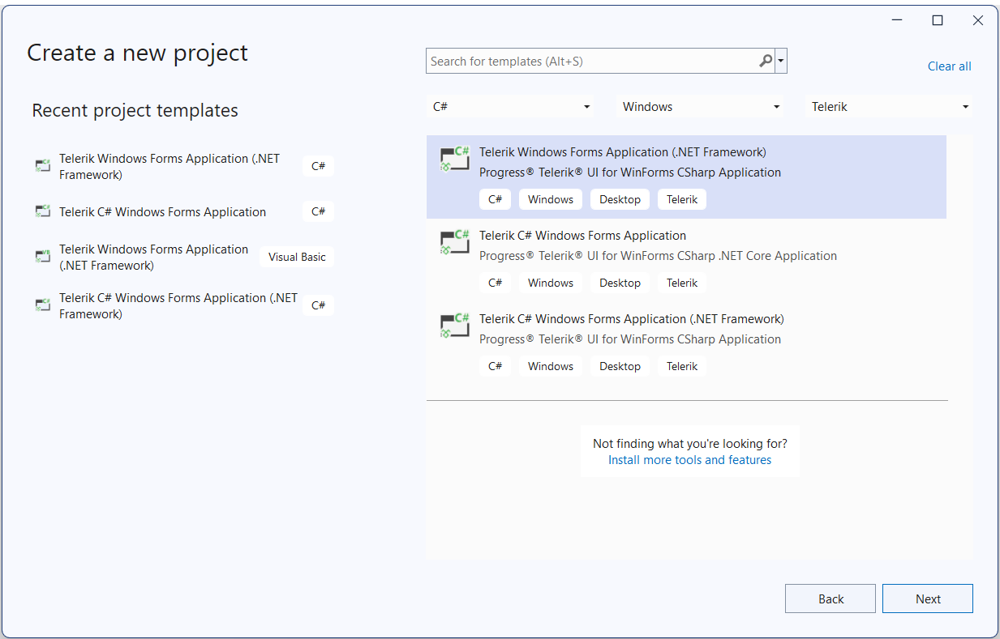

# Create project

## 

With the new Visual Studio Extensions for WinForms you can quickly create an application pre-configured to use Telerik UI for WinForms. The quickest way to have such a project is using the Visual Studio New Project Wizard. Under the Telerik node there is a new node – Windows, where two project templates exist: 

For convenience the same project templates could be found under the __Visual C# -> Windows__  and __Visual Basic -> Windows__ nodes.

After you click the __OK__ button, you get the Create New Project Wizard, provided by the Telerik UI for WinForms Visual Studio Extensions. The wizard detects all the installed distributions of Telerik UI for WinForms and lists them in a combo box. You can select a version which you want to be applied to your project. You can select what type of project to be created: Standard, Word-Inspired or Outlook-Inspired. You can access the Create New Project Wizard through the Telerik menu when you need to create a new Telerik WinForms application: 

The Create New Project Wizard lets you:

* Select a Telerik UI version from the list of versions detected on your system

* Select the Enable HDPI option in order to add support for high DPI awareness in your application

* Download the latest versions available on our website using the __GET LATEST__ button

* Specify which assemblies your project would use. When selecting a UI for WinForms assembly all dependent controls are selected automatically and vice-versa.

>tip GET LATEST button is available only when there is a newer version released on our web site.
>
>If you prefer the Telerik assemblies to be copied into your solution folder, the __Copy referenced assemblies to solution and source control__ option could be selected only into the [Visual Studio Extensions Options](https://docs.telerik.com/devtools/winforms/visual-studio-integration/visual-studio-extensions/options).
>important Note that the "Enable HDPI" option is availaible from version 2019.1
When you click the Finish button:

* The selected assembly references get added to your project

* A default application-wide theme gets set according to the selected project type.

* An app.manifest file is included to the project if you have selected the "Enable HDPI" option.

# See Also

 * [Automatic Dependency Resolving]()

 * [Upgrade Project]()

 * [Download New Version]()