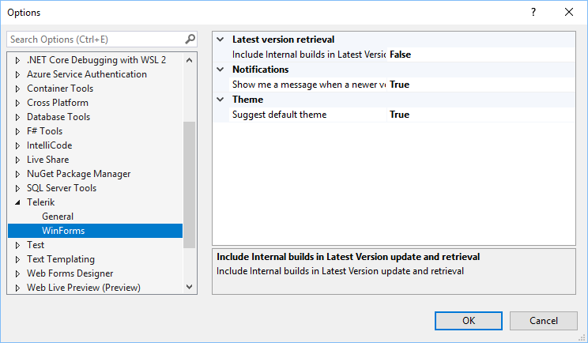
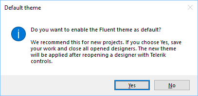

# Default Theme 

All RadControls from the Telerik UI for WinForms suite get the **ControlDefault** theme applied to them by default if no other theme is set. As of **R1 2021**, it is possible to define which theme is your [default theme]() (e.g. **ControlDefault**) for the controls even at design time. This can be defined in the App.config file.

## Options

As of **R2 2021** in the [Options dialog](), there is a setting that controls whether the message for changing the default theme will be shown.

If **"Suggest default theme"** is set to **true**, the following message will be prompted to the user when you drag a Telerik RadControl from the toolbox and drop it onto the form:

If you accept the changes and restart the designer, the Fluent theme will be used as [default theme]() for the design time experience.

# See Also

* [Default Theme]()