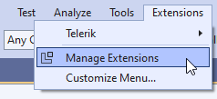
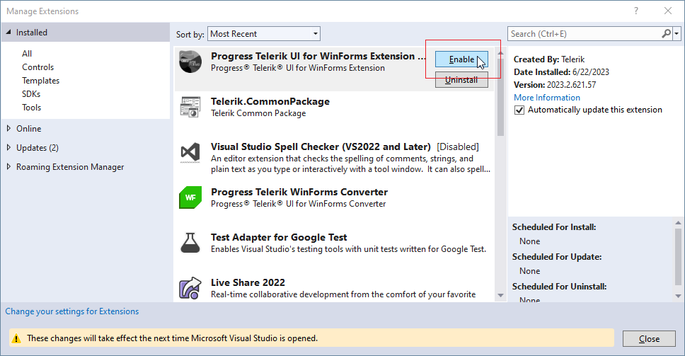
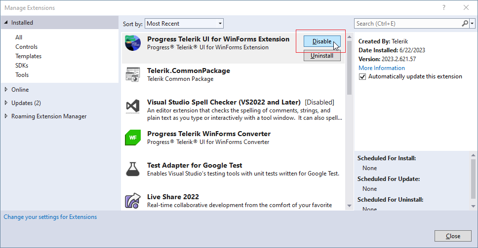
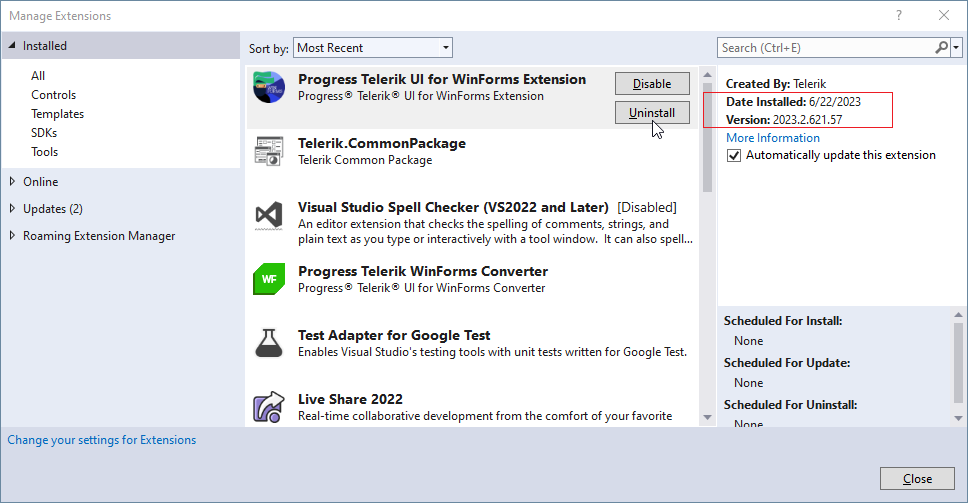
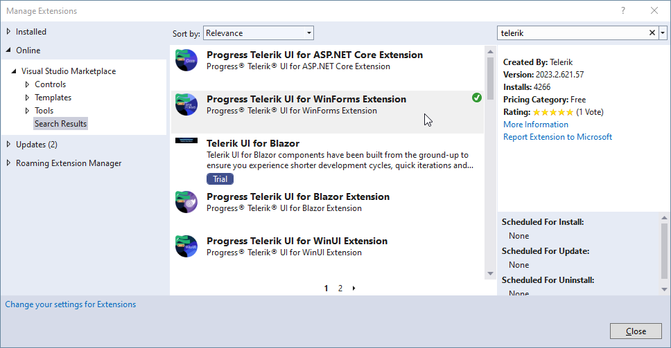

# Manage Extensions

**Progress Teletik UI for WinForms Extensions** can be installed / enabled / disabled by the **Extensions** menu in Visual Studio. It is necessary to select the **Manage Extensions** menu item: 

If the Extension is already installed you can enable or disable it:

>caption Enable UI for WinForms Extension

>caption Disable UI for WinForms Extension

On the right side you have information about the specific **Version** of the Extension. If the version is not the desired one, you can uninstall the extension first by using the corresponding button:

Then, you can install a newer version by searching in the Online section of the dialog:

 

 