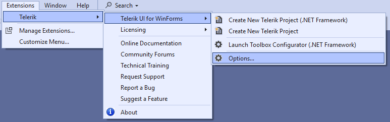
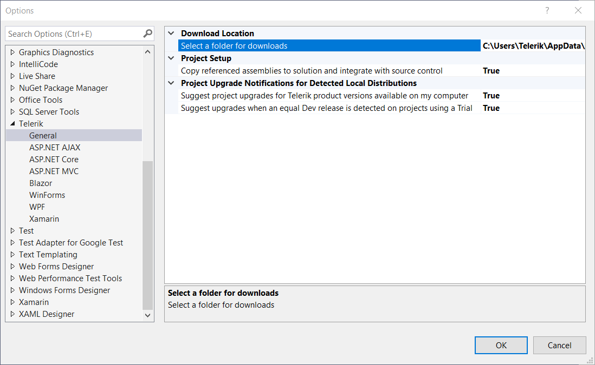
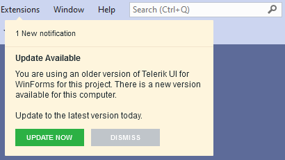
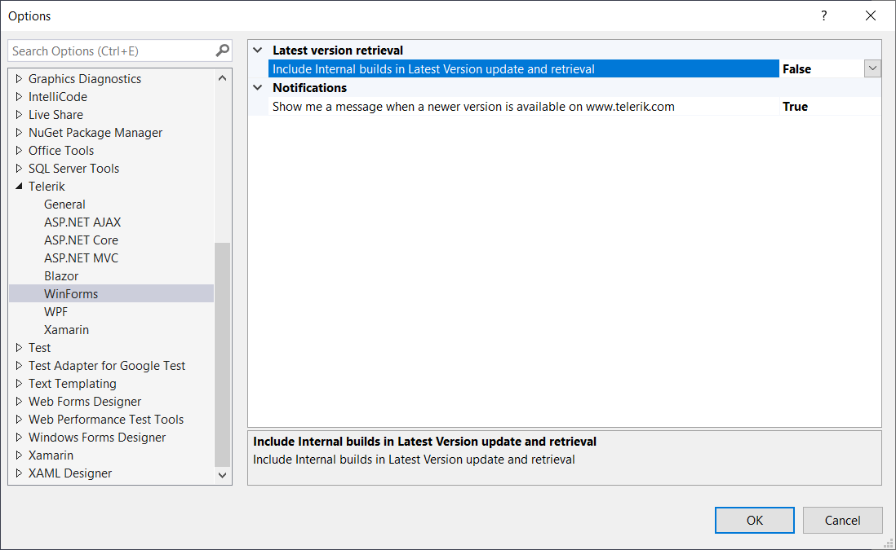
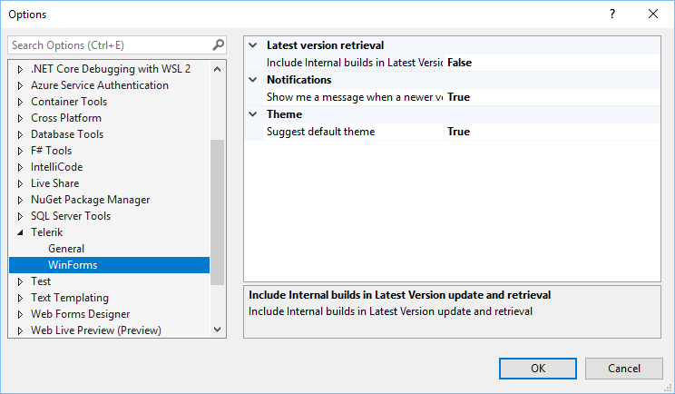
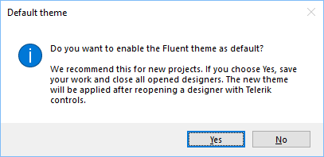

# Options

The __Visual Studio Extensions__ options dialog provides settings, so you can configure the Telerik Visual Studio Extensions to best suit your needs.

It can be accessed through the **Visual Studio >> Extensions >> Telerik >> Telerik UI for WinForms >> Options**:

The __Options__ dialog contains two sets of options that affect the __Telerik UI for WinForms__ Visual Studio Extensions.

The settings under the __General__ category affect all of the installed __Telerik Visual Studio Extensions__.

## Project setup

__Copy referenced assemblies to solution and integrate with source control__ - When enabled, the referenced assemblies will be copied to the solution when using Telerik wizards

## Project Upgrade Notifications for Detected Local Distributions

* **Show me a message when a newer version is available on www.telerik.com**  – When enabled, you will be prompted to upgrade upon opening a project, which is not using the latest version of Telerik UI for WinForms installed on your system.

	

* **Include Internal builds in Latest Version update and retrieval** - When enabled, the [Latest Internal Builds] () will also be included when prompting to upgrade upon opening a project, which is not using the latest version of Telerik UI for WinForms installed on your system.

All settings under the WinForms category affect only the Telerik UI for WinForms Visual Studio Extensions.

>note As of **R2 2021** in the **Options** dialog, there is a setting that controls whether the message for changing the default theme will be shown. 

If **"Suggest default theme"** is set to **true**, the following message will be prompted to the user when you drag a Telerik RadControl from the toolbox and drop it onto the form:

If you accept the changes and restart the designer, the Fluent theme will be used as [default theme]() for the design time experience.
 
## Select a folder for downloads

Configures the path where the extensions look for and store distributions.

>tip Changing the folder path will not move existing folder contents from your previous path. Please, move your previous folder contents manually in case you still want to use them.

## Latest version retrieval

__Include internal builds in Latest Version update and retrieval__ – When enabled, the __[Latest Version Acquirer]()__ tool will retrieve internal builds as well as official releases when checking for a new version.

## Notifications

__Show me a message when a newer version is available on__ [www.telerik.com](http://www.telerik.com). When enabled and solution containing an UI for WinForms project is loaded, you will receive notification if a new version of __Telerik UI for WinForms__ is available on the Telerik website.