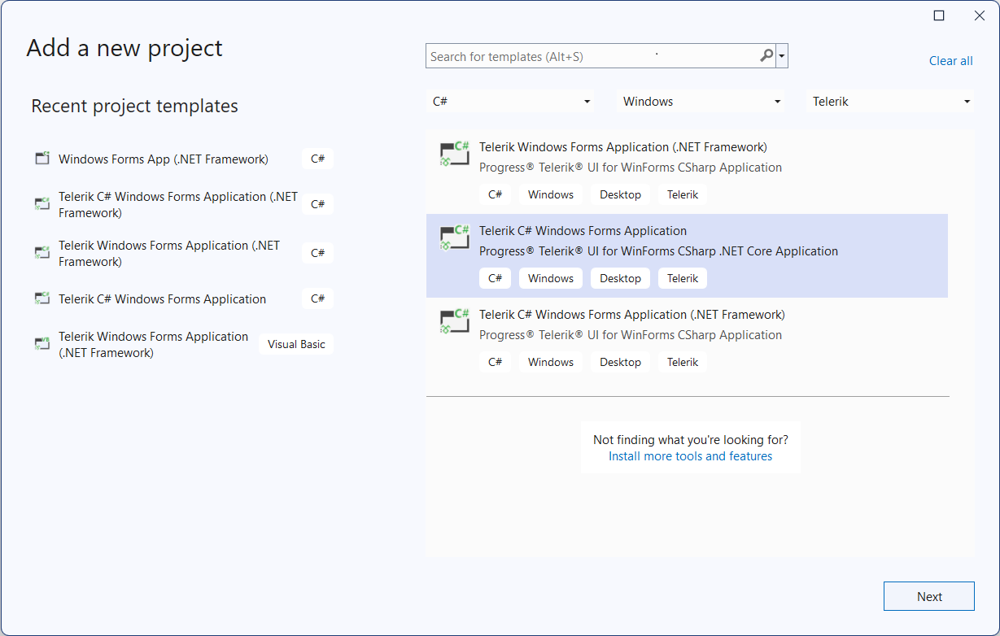

# Visual Studio Extensions

__Visual Studio Extensions__ for __Telerik UI for WinForms__ aim to help developers when creating WinForms Application with __Telerik UI for WinForms__.

The extensions handle the following major points in the development with __Telerik UI for WinForms__:

* __Project creation, conversion and configuration__ – reference management.

* __Project Upgrade__ - upgrading __Telerik UI for WinForms__ to a new version.

* __Common scenario page creation__ - aid creating pages with basic scenarios in the usage of __Telerik UI for WinForms__.

* __Toolbox configuration__ – select what version of Telerik UI to be populated in the Toolbox.

__Visual Studio Extensions__ for __Telerik UI for WinForms__ are distributed with the __Telerik UI for WinForms__ installer. They can be downloaded and installed as separate product from the [Visual Studio Gallery](https://visualstudiogallery.msdn.microsoft.com/) for Visual Studio 2012 and later. The extensions support Visual Studio 2008, 2010, 2012, 2013, 2015, 2017, 2019 and 2022, handling .NET 2.0+ applications.

The __Visual Studio Extensions__ can be accessed through the __Telerik | Telerik UI for WinForms__ menu which has different menu items depending on the selected project in Visual Studio. The extensions can be accessed through the context menu of a WinForms Application as well.

For Visual Studio 2019 **Visual Studio Extensions** can be accessed through the **Extensions | Telerik UI for WinForms menu**:

__No selected project in Visual Studio__

__Selected project in Visual Studio is Standard WinForms Application__

__Selected project in Visual Studio is Telerik WinForms Application__

When installed, the extensions add several project templates to the New Project dialog of Visual Studio:

>tip These are available in the language specific nodes of the dialog as well. New Project dialog contains __Telerik WinForms Application__ under both CSharp\Windows and Visual Basic\ Windows nodes.
