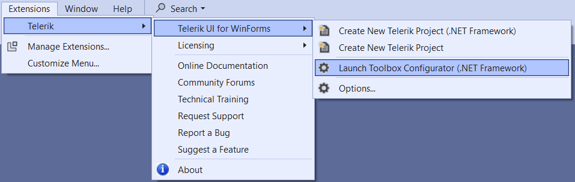
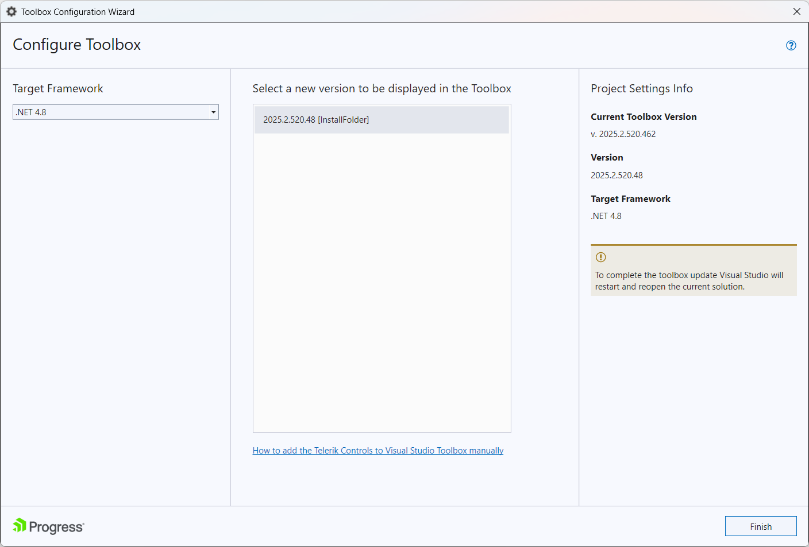

# Set Toolbox Version

## 

Starting with __Q3 2010__ we introduced the __Toolbox Configuration__ utility. Its purpose is to choose which version of __Telerik UI for WinForms__ to be populated in the Visual Studio’s Toolbox. The user can select among all versions of the suite that are currently on the machine and have been either installed or downloaded using the __VS Extensions__.
        

The Toolbox Configurator can be launched from the Telerik menu:

The user can make his selection using the dropdown menu which lists all versions discovered on the machine. When the Finish button is clicked Visual Studio will be restarted so that the changes can take effect.

        

The __Toolbox Configurator__ is supported in Visual Studio 2008, 2010, 2012, 2013 and 2015.

>tip The Toolbox Configurator will overwrite the toolbox registration performed during installation. Additionally, the Toolbox Configurator registers the selected version of Telerik UI for WinForms in AssemblyFoldersEx. This makes them visible in the Add Reference dialog and Choose Toolbox Items dialog (accessible from the toolbox context menu).
>

