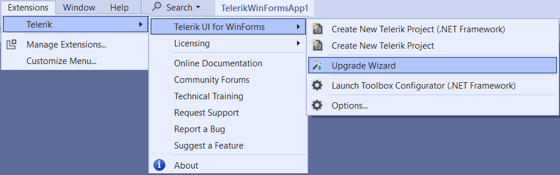

# Upgrade project

The **Project Upgrade Wizard** is an essential feature of the Telerik Visual Studio Extensions that streamlines the process of upgrading your Telerik UI for WinForms projects to newer versions.

## Overview

The Upgrade Wizard can be accessed in Visual Studio by **Extensions > Telerik > Telerik UI for WinForms > Upgrade Wizard**. It simplifies the process of changing the Telerik UI for WinForms version used in your projects. This tool ensures a smooth transition between versions while maintaining project integrity.

## Prerequisites

Before using the Project Upgrade Wizard, ensure that:

- You have the latest version of Telerik Visual Studio Extensions installed
- Your project currently uses Telerik UI for WinForms controls
- Visual Studio is closed for any projects you plan to upgrade (recommended)

## Key Features

In addition to updating assembly references, the upgrade wizard provides several important additional features:

- **Version Detection**: Automatically checks if a new version of Telerik UI for WinForms is available on the Telerik website
- **Automatic Download**: Downloads newly discovered versions directly from the wizard
- **Toolbox Integration**: Updates the Visual Studio toolbox with the new control versions
- **Theme Upgrade**: Upgrades project themes to be compatible with the new version
- **Backup Creation**: Creates a backup of your current project before making changes
- **Batch Processing**: Upgrades multiple projects in a solution simultaneously

## Step-by-Step Upgrade Process

### Step 1: Initialize the Upgrade Wizard

You can find the Upgrade Wizard when select the solution file in Visual Studio, then go to **Extensions > Telerik > Telerik UI for WinForms > Upgrade Wizard**.

Alternatively, you can right-click with mouse over a project file, then from the menu choose **Telerik UI for WinForms > Upgrade Wizard**.

### Step 2: Upgrade Wizard Information

The wizard starts with an overview of the upgrade process, providing essential information about what will be updated and any important considerations.

### Step 3: Select Projects and Target Version

The wizard displays all projects in your solution that use Telerik UI for WinForms. Here you can:

- **Select Projects**: Choose which projects to upgrade. It's recommended to upgrade all projects to maintain version consistency in your solution.
- **Choose Target Version**: Select the Telerik UI for WinForms version to upgrade.
- **Check Compatibility**: Use the **Compatibility** button to invoke the [Upgrade API Analyzer tool](http://docs.telerik.com/devtools/winforms/api-analyzer) to identify potential breaking changes.

>note Upgrading all projects in a solution to the same version prevents compatibility issues and ensures consistent behavior across your application.

### Step 4: Configure Toolbox and Backup Options

The final configuration screen allows you to:

- **Update Toolbox**: Update the Visual Studio Toolbox with the newly selected control versions to prevent accidental reference mismatches during drag-and-drop operations.
- **Create Backup**: Create a backup of your current project before applying changes (highly recommended).

### Step 5: Visual Studio Restart

Visual Studio will restart automatically to complete the toolbox update. If automatic restart fails, manually restart Visual Studio to finish the upgrade process. This ensures all new controls are properly registered in the toolbox.

## Important Notes and Considerations

#### Version Detection
- The distribution selection screen automatically detects versions installed via Windows Installer MSI package
- Versions downloaded by the Upgrade Wizard are detected
- Versions available in the Global Assembly Cache (GAC) are detected
- **Limitation**: Manually downloaded hotfixes cannot be automatically detected

#### Latest Version Access
- Use the **GET LATEST** button to access the [Latest Version Acquirer]()
- This feature downloads the most recent version available from the Telerik website
- Ensures you always have access to the newest features and bug fixes

#### Distribution Content

- Documentation and Live Examples are not included in wizard downloads
- For complete installations with documentation, use the full [MSI installer]()

# See Also

* [Configure Project]()
* [Automatic Dependency Resolving]()
* [Download New Version]()
* [How to Upgrade a Telerik UI for WinForms Project]()