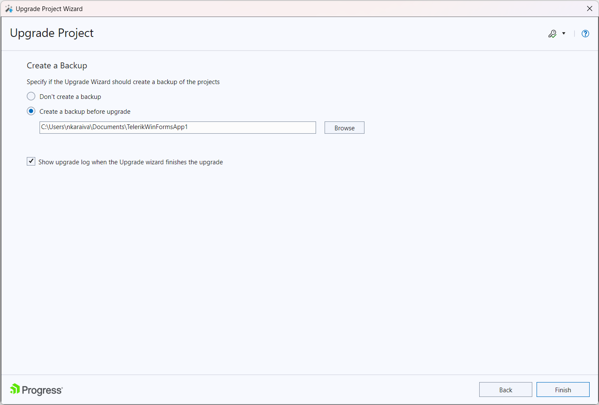

# Upgrade project

##

An important feature in the Visual Studio Extensions is the __Project Upgrade Wizard__.

The Upgrade Wizard (started by using the __Telerik > Telerik UI for WinForms > Upgrade Wizard__ menu item) is used to change the version of __Telerik UI for WinForms__ your projects use.

In addition to the pure assembly reference change, the upgrade wizard provides several important features:

* Check if a new version of __Telerik UI for WinForms__ is available on the Telerik website.

* Download of a newly discovered version.

* Visual Studio toolbox update.

* Project themes upgrade.

* Current project backup.

On the first step the wizard provides basic update process information:

On the next step the wizard lists all projects from the solution, which use Telerik UI for WinForms. You can choose which projects will be updated (it is recommended to upgrade all projects to the chosen version, not just part of them) and the version which they will be upgraded to. The Compatibility button will invoke the [Upgrade API Analyzer tool](http://docs.telerik.com/devtools/winforms/api-analyzer):

The next screen allows you to update the Visual Studio Toolbox with the newly selected controls, so that you avoid accidental reference change during a control drag and drop, as well as creating a backup of your project:

Notes:

* The Telerik UI for WinForms distribution selection screen lists all the versions that can be detected automatically. These are versions, installed by using the Windows Installer MSI package, versions, downloaded by the Upgrade Wizard and versions, available in the GAC. Hotfixes, downloaded manually cannot be detected.

* You can use the __GET LATEST__ button to access the Latest Version Acquirer and download the latest available version on our website.

* The distribution, downloaded by the Upgrade Wizard contains only the "hotfix" files, e.g. the barebone files, needed for a project to run correctly. It does not contain the documentation or the Live Examples.

* A Visual Studio restart will be required in order to update your toolbox. If the automatic restart fails, a restart should be initiated manually in order to complete the toolbox upgrade.

# See Also

* [Configure Project]()

* [Automatic Dependency Resolving]()

* [Download New Version]()