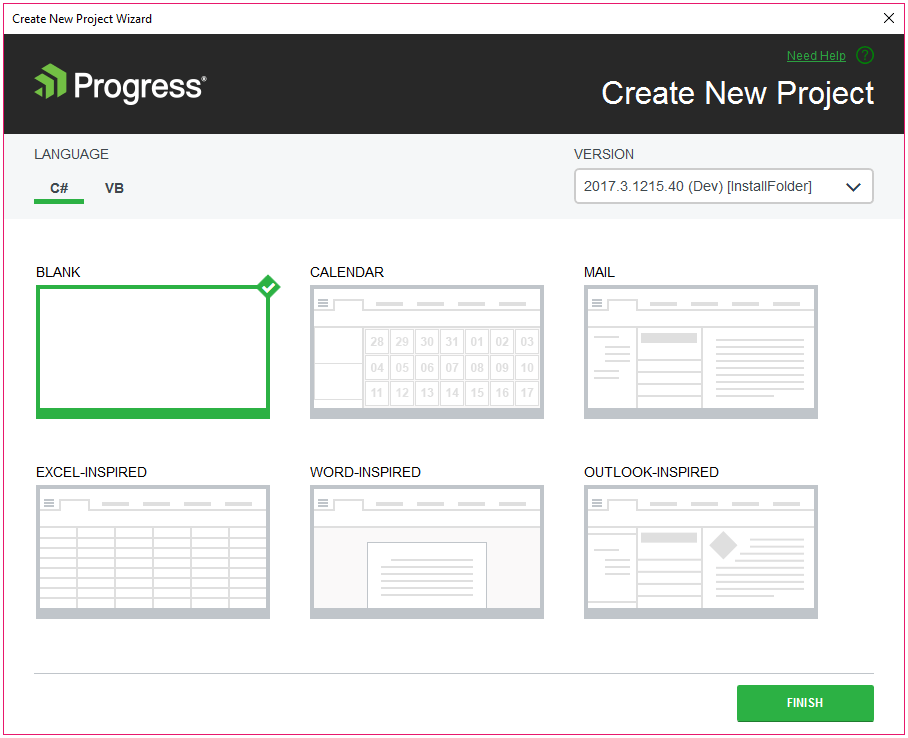
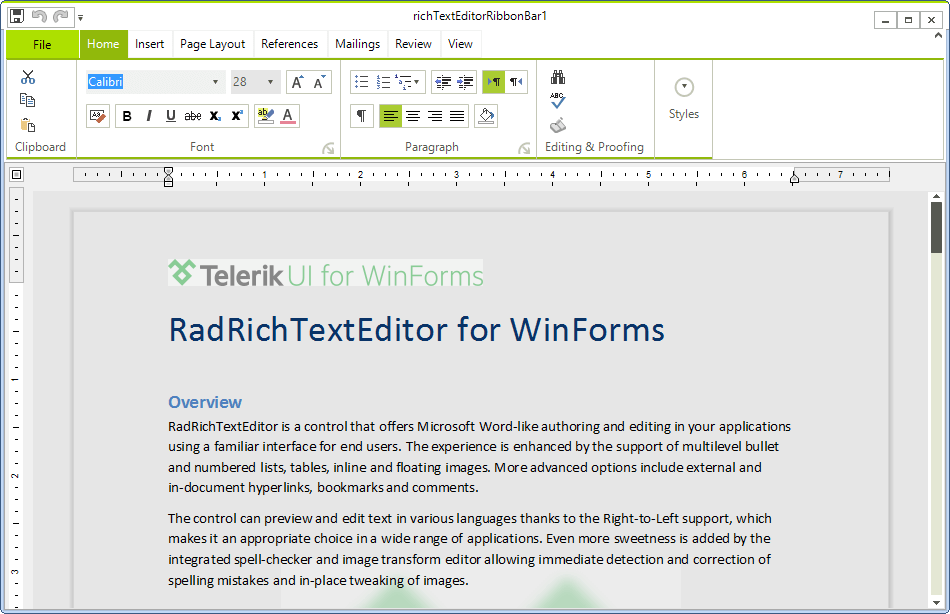
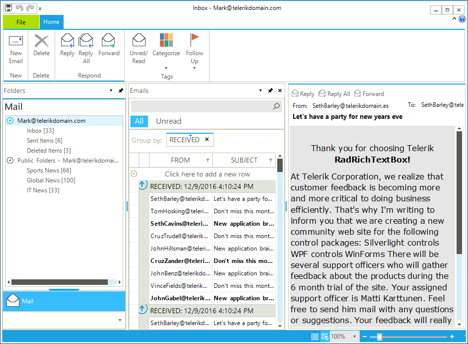
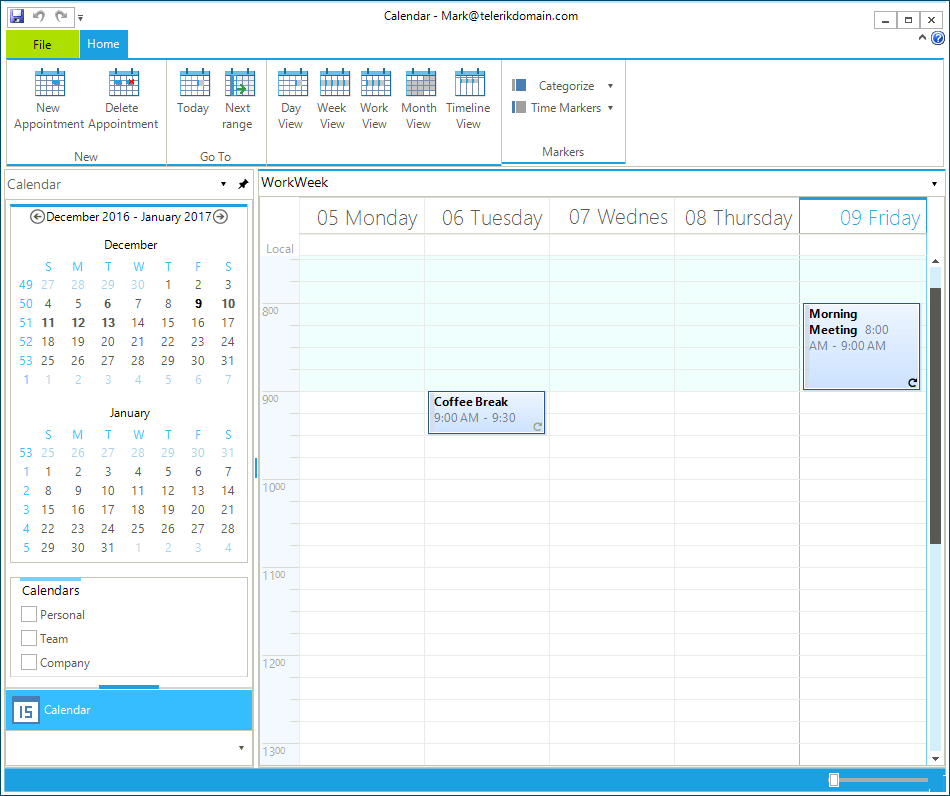
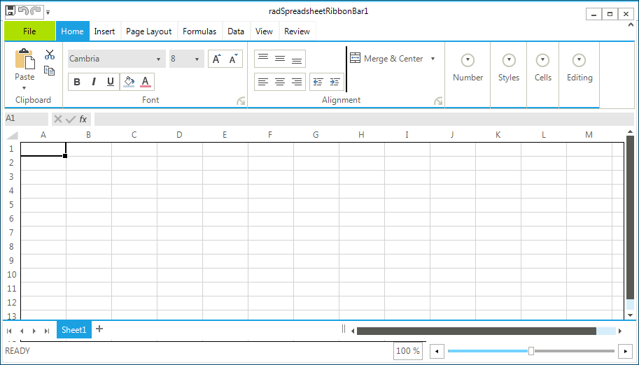

# Visual Studio Templates

The Visual Studio Templates for __UI for WinForms__ provide an easy way to create a Telerik project from a number of predefined templates. With just a few clicks you can start building a Windows inspired application. Currently, you have the option to choose from the following templates:

* [Word-Inspired Template](#word-inspired-template) (available with Q1 2015 release version)

* [Outlook-Inspired Template](#outlook-inspired-template) (available with Q1 2015 release version)

* [Outlook-Inspired Mail Template](#outlook-inspired-mail-template) (available with Q1 2015 release version)

* [Outlook-Inspired Calendar Template](#outlook-inspired-calendar-template) (available with Q2 2015 release version)

* [Excel-Inspired Template](#excel-inspired-template) (available with Q3 2017 SP1 release version)

>tip The [Word-Inspired Template](#word-inspired-template) uses the __TelerikMetro__ theme. The outlook inspired templates make use of the __TelerikMetroBlue__ theme.
In this article you will find more information on how to create a project from one of the available templates as well as more details regarding what controls each template contains.

## Getting Started

When creating new project, select the needed template as seen on __Figure 1__.

>caption Figure 1: Select Template

## Word-Inspired Template

The __Word-Inspired Template__ implements Word-like editing experience represented with the __Telerik UI for WinForms__ controls. It provides a complex integration of controls like __RichTextEditorRibbonBar__, __RadRichTextEditor__ in an already set up example. It also demonstrates the broad range of editing and formatting capabilities as well as built in specific features of these controls. In fact the __Word-Inspired Template__ is almost identical to the __RadRichTextEditor__'s First Look example in our demo application.

>caption Figure 2: Word-Inspired Template

## Outlook-Inspired Template

In this template we joined the powers of some of the most prominent controls in __Telerik UI for WinForms__ to create one of the most recognizable applications in the world – Microsoft Outlook. You can easily spot __RadGridView__, __RadRichTextEditor__, __RadScheduler__, __RadDock__ and __RadCalendar__ how blend seamlessly. The Visual Studio template can be used for a quick start of any other business application. The __Outlook-Inspired Template__ is built from two separate templates available in Visual Studio – __Outlook-Inspired Mail Template__ and __Outlook-Inspired Calendar Template__. They are separated so you can use only the needed functionality in the cases in which you need only the email interface or the calendar one.

Full list of controls used in the __Outlook-Inspired Template__ can be found below:

* __RadRichTextEditor__
* __RichTextEditorRibbonBar__
* __RadScheduler__
* __RadDock__
* __RadGridView__
* __RadPageView__
* __RadTreeView__
* __RadCalendar__
* __RadToggleButton__
* __RadStatusStrip__
* __RadTrackBar__
* __RadPanel__
* __RadRibbonBar__
* __RadTextBoxControl__
* __RadLabel__
* __RadButton__
* __TelerikMetroBlueTheme__

You can see how the different parts of the template look like on __Figure 3__ and __Figure 4__.

## Outlook-Inspired Mail Template

The Outlook-Inspired Mail Template can be used separately and it has been integrated as the mail part of the [Outlook-Inspired Template](#outlook-inspired-template). You can see it on __Figure 3__.

>caption Figure 3: Outlook-Inspired Mail Template

## Outlook-Inspired Calendar Template

The Outlook-Inspired Calendar Template can be used separately and it has been integrated as the calendar part of the [Outlook-Inspired Template](#outlook-inspired-template). You can see how the template looks like on __Figure 4__.

>caption Figure 4: Outlook-Inspired Calendar Template

## Excel-Inspired Template

The Excel-Inspired Template implements Excel-like editing experience represented with the Telerik UI for WinForms controls. It provides a complex integration of controls like **RadSpreadsheetRibbonBar** and **RadSpreadsheet** in an already set up example.You can see how the template looks like on __Figure 5__.

>caption Figure 5: Excel-Inspired Template

# See Also

* [Visual Studio Extensions]()
* [Create Telerik Project]()
* [Project Configuration Wizard]()
* [Using Default Themes]()