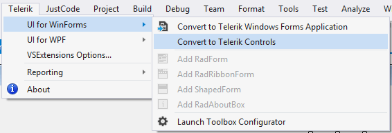
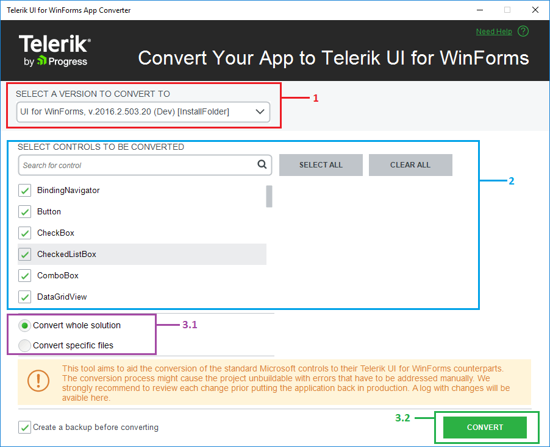
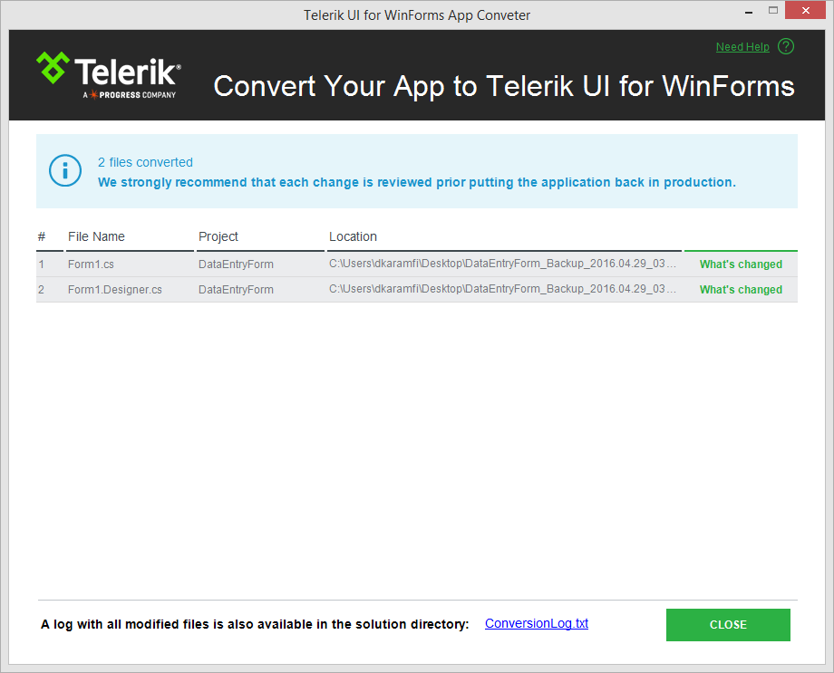
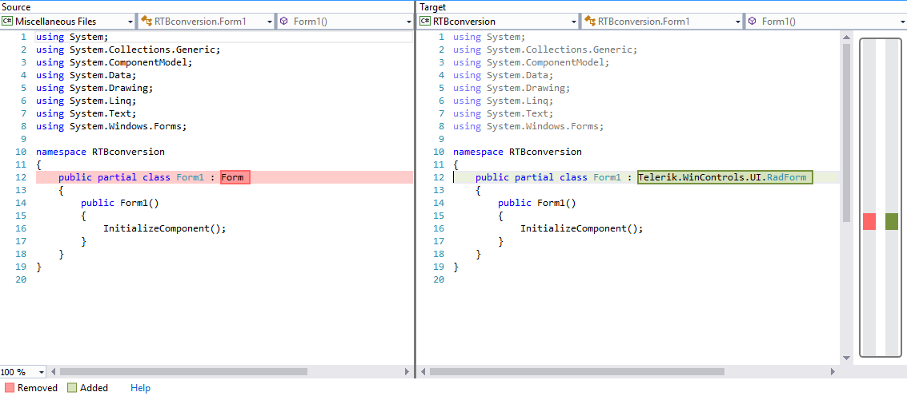
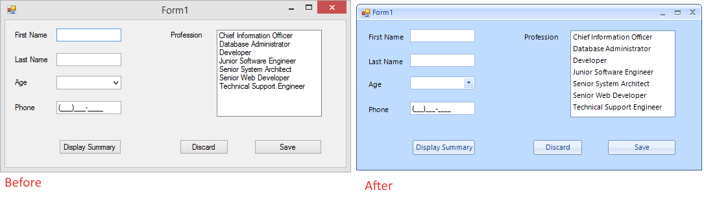
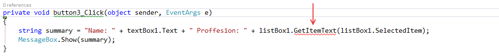

# Convert your existing application to Telerik UI for Winforms

This article will guide you through the process of converting the Microsoft Windows Forms controls in your application to Telerik UI for Winforms counterparts. 

>note We strongly recommend you using a source control system like TFS or Git. This will allow you to review the changes and restore to previous version if needed. 

1. Before starting you need to open a solution which contains a project that is using standard Microsoft Winforms controls. This will enable the converter option in the `UI for WinForms menu` item.

    

2. Clicking the menu item will open the following window where you can perform the following actions: 

    1\. Select a version - you can choose between all installed versions, including the ones for .NET 2.0 and .NET 4.0.

    2\. Select controls - you can choose which controls you can convert. For this example leave all controls selected. 

    3\. The `Convert` button - pressing this button will start the conversion process. Please note that you cannot go back to this window.  

    

3. Press `Convert` and wait until the project is converted. Once the conversion process is complete, the summary dialog will appear. This will allow you to see which files are converted. You can open the generated log as well.

    

    At this step you can compare the old and the converted files. To do that just click the __`What's Changed`__ link in the file list. This will open the files tabs in Visual Studio and you will be able to review the changed code.
    
    

4. Click `Close` and open the designer in the converted project. You will see that the project and the controls are now converted. The following image shows the application before and after the conversion process.

    

5. The final step is to resolve any compile time errors. There are properties and methods which do not have analogs in our implementation. Since the converter does not remove the code for these, you will get a compile time error:
    

>note After the conversion process is completed, you should check if all existing functionality is working as before.

## See Also

* [Requirements] ()
