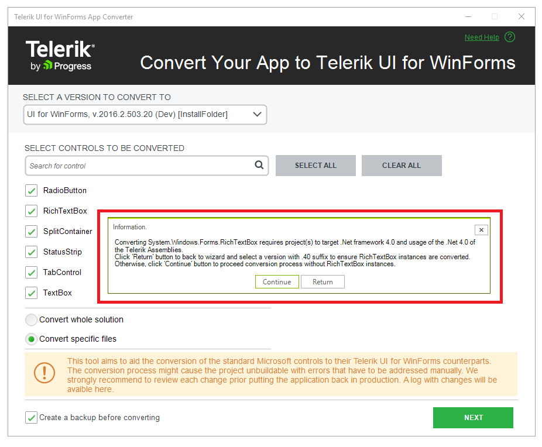

# RichTextBox

__RichTextBox__ is converted to [RadRichTextEditor](). The following tables describe which properties, methods and events are removed and which are replaced with similar equivalents.

>important When the project that is being converted has target framework less than 4.0 and the user selects UI for WinForms[Version].__20__ the following message box will appear:
>caption Figure 1: Converting System.Windows.Forms.RichTextBox

>important Since __RadRichTextEditor__ is available only for .NET 4.0, the conversion tool requires WinForms[Version].__40__. If you press `Return` you will be allowed to select another target version. If you press `Continue`, the conversion tool will proceed, but the System.Windows.Forms.RichTextBox won't be converted.
>
|Properties|Action|RadControls Equivalent|
|---|---|---|
|AutoWordSelection|Produces Error||
|BorderStyle|Removed||
|BulletIndent|Produces Error||
|DetectUrls|Replaced with|AutoInsertHyperlinks|
|EnableAutoDragDrop|Produces Error||
|HideSelection|Produces Error||
|MaxLength|Produces Error||
|Modified|Produces Error||
|Multiline|Produces Error||
|ReadOnly|Replaced with|IsReadOnly|
|RightMargin|Produces Error||
|SelectionColor|Produces Error||
|SelectionBackColor|Produces Error||
|SelectionBullet|Produces Error||
|SelectionFont|Produces Error||
|SelectedText|Produces Error||
|SelectionProtected|Produces Error||
|ScrollBars|Produces Error||
|ShortcutsEnabled |Produces Error||
|ShowSelectionMargin|Produces Error||
|WordWrap |Produces Error||
|ZoomFactor|Produces Error||

|Methods|Action|RadControls Equivalent|
|---|---|---|
|AppendText|Replaced with|Insert|
|CanPaste|Produces Error|
|Clear|Replaced with|ResetText|
|ClearUndo|Replaced with|Document.History.Clear|
|DeselectAll|Replaced with|Document.Selection.Clear|
|GetFirstCharIndexFromLine|Produces Error||
|GetCharFromPosition|Produces Error||
|GetCharIndexFromPosition|Produces Error||
|GetFirstCharIndexOfCurrentLine|Produces Error||
|GetPositionFromCharIndex|Produces Error||
|LoadFile|Produces Error||
|SaveFile|Produces Error||
|ScrollToCaret|Produces Error||
|SelectAll|Replaced with|Document.Selection.SelectAll|

|Events|Action|RadControls Equivalent|
|---|---|---|
|AcceptsTabChanged|Produces Error||
|BorderStyleChanged|Produces Error||
|ContentsResized |Produces Error||
|Hscroll|Produces Error||
|HideSelectionChanged|Produces Error||
|ImeChange|Produces Error||
|LinkClicked|Produces Error||
|ModifiedChanged|Produces Error||
|MultilineChanged|Produces Error||
|Protected|Produces Error||
|ReadOnlyChanged|Produces Error||
|VScroll |Produces Error||

## See Also

* [Step-by-step tutorial]()
* [Requirements]()
