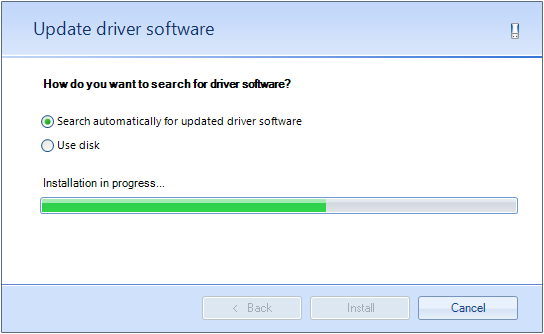

# Pages

__RadWizard__ contains a collection of __WizardPage__ elements. The pages are __Internal (WizardPage), Welcome (WizardWelcomePage)__, and __Completion (WizardCompletionPage)__.
        

Each wizard page contains a __ContentArea__ which hosts Win Forms controls. Below is an example of a page containing several controls:

You can define the page header’s title and header text by using the __Title__ and __Header__ properties of the page.
		
__RadWizard__ allows you to customize the elements of its page header. You can use the properties of the control to apply preferences for all pages or use the properties of a page to customize it.
		
The exposed in __RadWizard__ properties for customization of the page header are:

|Property|Description|
|----|----|
|__PageTitleTextVisibility__|defines the visibility of the page header's title element.|
|__PageHeaderTextVisibility__|defines the visibility of the page header's header element.|
|__PageHeaderIcon__|defines the page header icon.|
|__PageHeaderIconAlignment__|defines the page header icon alignment.|
		  
The page header customization properties of the page are considered if its __CustomizePageHeader__ property has value *true*.  They have higher priority than the defined in the control. You can use the following properties to customize the page header of a particular page:

|Property|Description|
|----|----|
|__TitleVisibility__|defines the visibility of the page header's title element for the particular page.|
|__HeaderVisibility__|defines the visibility of the page header's header element for the particular page.|
|__Icon__|defines the page header icon for the particular page.|

The  **WizardWelcomePage** and **WizardCompletionPage** have an image before its __ContentArea__. These images are defined and customized using similar to the explained above approach.

The exposed in __RadWizard__ properties for customization of the welcome images are:

|Property|Description|
|----|----|
|__WelcomeImage__|defines the image of the welcome pages.|
|__HideWelcomeImage__|defines whether the image of the welcome pages should be visible.|
|__WelcomeImageLayout__|defines the layout of the welcome pages image.|
|__WelcomeImageBackgroundShape__|defines the background image shape of the welcome pages. It is usually defined in the control theme.|

The welcome page’s **WelcomeImage**  property defines the image for the particular **WizardWelcomePage** with a higher priority than the RadWizard.__WelcomeImage__ property.

You can use the same set of properties to customize the image of the **WizardCompletionPage**.

# See Also

* [Design Time]()	
* [Modes]()
        
