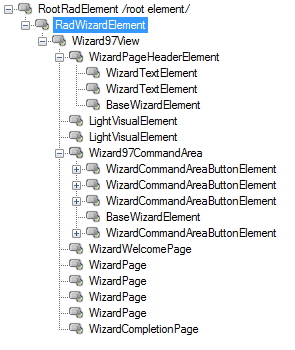

# Right-to-Left support


## 

The __RadWizard__ control also supports __RightToLeft__ alignment of its elements:


			
			You can enable the RightToLeft functionality, by setting the __RightToLeft__ property to *True*:
			#_[C#] Setting Right-to-Left mode_

	


{{source=..\SamplesCS\Wizard\WizardStructure.cs region=RTL}} 
{{source=..\SamplesVB\Wizard\WizardStructure.vb region=RTL}} 

````C#
            this.radWizard1.RightToLeft = RightToLeft.Yes;

            this.radLabel1.RightToLeft = RightToLeft.Yes;
            this.radLabel1.Text = "Welcome page of RadWizard in RightToLeft mode.";
````
````VB.NET
        RadWizard1.RightToLeft = System.Windows.Forms.RightToLeft.Yes

        RadLabel1.RightToLeft = System.Windows.Forms.RightToLeft.Yes
        RadLabel1.Text = "Welcome page of RadWizard in RightToLeft mode."
        '
````

{{endregion}} 


