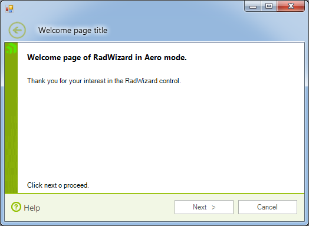

# Structure

## 

__RadWizardElement__ encapsulates the UI representation and functionality of __RadWizard__. This element initializes the view of the control:
        
			

* __Wizard97View__ for the __Wizard 97 mode__.

* __WizardAeroView__ for __Wizard Aero mode__.

The view contains the following elements:
			

* __Pages collection__ – collection which contains *Internal*, *Welcome* 
			  	and *Completion RadWizard* pages.
			  

* __Page header__ – element which is located above each page and contains elements for *title text*,
			  	*header text* and *page icon*.
			  

* __Command area__– element which is located below each page and contains command button – 
			  		*Back (Wizard 97)*, *Next, Cancel, Finish,* and *Help*.
			  

* __Welcome image__– element which contains the image of the *Welcome* page.
			  

* __Completion image__ - element which contains the image of the *Completion* page.

* __Top element__– element which contains the *Back* button of *Wizard Aero* view.

On the screenshots below, you can see the Welcome pages for both wizard mode with the described elements in them:
	    

__Wizard97__

__Wizard Aero__

